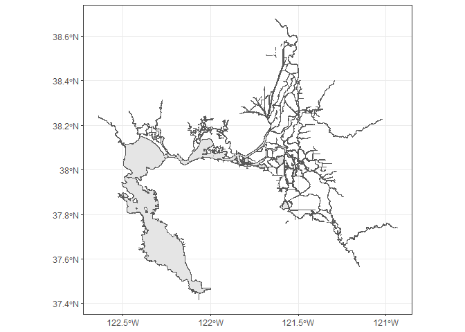

<!-- README.md is generated from README.Rmd. Please edit that file -->

# deltamapr

<!-- badges: start -->

[](https://github.com/InteragencyEcologicalProgram/deltamapr/actions)
<!-- badges: end -->

The goal of deltamapr is to provide spatial data for the Bay-Delta.

## Installation

You can install the development version from
[GitHub](https://github.com/) with:

``` r
# install.packages("devtools")
devtools::install_github("InteragencyEcologicalProgram/deltamapr")
```

## Included data sets

``` r
require(deltamapr)
require(ggplot2)
require(sf)
```

### Delta waterways

``` r
ggplot(WW_Delta)+
  geom_sf()+
  theme_bw()
```



### Full watershed waterways

``` r
ggplot(WW_Watershed)+
  geom_sf()+
  theme_bw()
```


### Delta regions

``` r
ggplot(R_EDSM_Mahardja)+
  geom_sf(aes(fill=SubRegion))+
  theme_bw()+
  theme(legend.position="none")
```


### [California aquatic resources inventory](https://www.sfei.org/data/california-aquatic-resource-inventory-cari-version-03-gis-data#sthash.zuIpGDaQ.dpbs)

#### CARI polygons

``` r
ggplot() +
  geom_sf(data = SFE_CARI_polygons, aes(fill = leglabel1))
```

#### CARI streams

``` r
ggplot() +
  geom_sf(data = SFE_CARI_streams)
```
