deltamapr
================

  - [Installation](#installation)
  - [Usage](#usage)
  - [Data types](#data-types)
  - [Waterways](#waterways)
      - [Delta waterways](#delta-waterways)
      - [Full watershed waterways](#full-watershed-waterways)
  - [Regions](#regions)
      - [Regions](#regions-1)
      - [Strata](#strata)
      - [Subregions](#subregions)
  - [Habitat](#habitat)
      - [California aquatic resources
        inventory](#california-aquatic-resources-inventory)

<!-- README.md is generated from README.Rmd. Please edit that file -->

<!-- badges: start -->

[](https://github.com/InteragencyEcologicalProgram/deltamapr/actions)
<!-- badges: end -->

The goal of deltamapr is to provide spatial data for the Bay-Delta.

## Installation

You can install the development version from
[GitHub](https://github.com/) with:

``` r
# install.packages("devtools")
devtools::install_github("InteragencyEcologicalProgram/deltamapr")
```

## Usage

This package contains data objects stored in
[`sf`](https://r-spatial.github.io/sf/) format, which can be accessed
with:

``` r
require(sf) # To ensure `sf` objects print correctly
#> Loading required package: sf
#> Linking to GEOS 3.8.0, GDAL 3.0.4, PROJ 6.3.1
deltamapr::WW_Delta
#> Simple feature collection with 282 features and 9 fields
#> geometry type:  POLYGON
#> dimension:      XY
#> bbox:           xmin: -122.6408 ymin: 37.41522 xmax: -120.9357 ymax: 38.67781
#> geographic CRS: NAD83
#> # A tibble: 282 x 10
#>      AREA PERIMETER HYDRO_POLY HYDRO_PO_1 HYDRO_24K_ TYPE  HNAME Shape_Leng
#>     <dbl>     <dbl>      <int>      <int>      <int> <chr> <chr>      <dbl>
#>  1 7.35e7  1033340         791        797        798 MR    SACR~    2.45   
#>  2 8.76e4     3319.       1965       1963       1964 S     W        0.0357 
#>  3 7.92e6    87428.       1967       1965       1966 C     SACT~    0.829  
#>  4 1.04e5     2719.       1970       1969       1970 L     GREE~    0.0264 
#>  5 1.06e5     2798.       1977       1974       1975 L     LAKE~    0.0283 
#>  6 1.59e5     3392.       1982       1978       1979 S     W        0.0314 
#>  7 4.26e4     1003.       1992       1989       1990 S     W        0.00952
#>  8 5.65e3      498.       2001       2008       2009 MR    SOUT~    0.00548
#>  9 4.14e3      502.       2006       2012       2013 MR    SOUT~    0.00536
#> 10 9.78e4     6630.       2008       2011       2012 MR    SOUT~    0.0746 
#> # ... with 272 more rows, and 2 more variables: Shape_Area <dbl>,
#> #   geometry <POLYGON [°]>
```

Or, after loading the package, like this:

``` r
require(deltamapr)
#> Loading required package: deltamapr
WW_Delta
#> Simple feature collection with 282 features and 9 fields
#> geometry type:  POLYGON
#> dimension:      XY
#> bbox:           xmin: -122.6408 ymin: 37.41522 xmax: -120.9357 ymax: 38.67781
#> geographic CRS: NAD83
#> # A tibble: 282 x 10
#>      AREA PERIMETER HYDRO_POLY HYDRO_PO_1 HYDRO_24K_ TYPE  HNAME Shape_Leng
#>     <dbl>     <dbl>      <int>      <int>      <int> <chr> <chr>      <dbl>
#>  1 7.35e7  1033340         791        797        798 MR    SACR~    2.45   
#>  2 8.76e4     3319.       1965       1963       1964 S     W        0.0357 
#>  3 7.92e6    87428.       1967       1965       1966 C     SACT~    0.829  
#>  4 1.04e5     2719.       1970       1969       1970 L     GREE~    0.0264 
#>  5 1.06e5     2798.       1977       1974       1975 L     LAKE~    0.0283 
#>  6 1.59e5     3392.       1982       1978       1979 S     W        0.0314 
#>  7 4.26e4     1003.       1992       1989       1990 S     W        0.00952
#>  8 5.65e3      498.       2001       2008       2009 MR    SOUT~    0.00548
#>  9 4.14e3      502.       2006       2012       2013 MR    SOUT~    0.00536
#> 10 9.78e4     6630.       2008       2011       2012 MR    SOUT~    0.0746 
#> # ... with 272 more rows, and 2 more variables: Shape_Area <dbl>,
#> #   geometry <POLYGON [°]>
```

## Data types

Three spatial data types are included in this package

1)  **Waterways**: Shapefiles of water coverage. These data files are
    preceded by the prefix *WW*.
2)  **Regions**: Shapefiles with sets of regions, subregions, or strata.
    These data files are preceded by the prefix *R*.
3)  **Habitat**: Shapefiles with habitat data. These data files are
    preceded by the prefix *H*.

# Waterways

``` r
require(ggplot2)
require(sf)
```

## Delta waterways

Produced by the California Department of Fish and Wildlife

``` r
ggplot(WW_Delta)+
  geom_sf()+
  theme_bw()
```

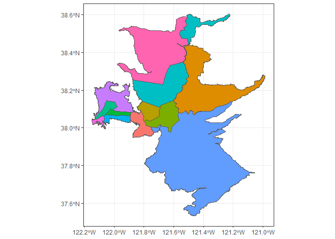

## Full watershed waterways

This shapefile includes data from CH2M Hill, and Wetland and Water
Resources, CDFG Ecosystem Restoration Program as a part of ERP Stage 2
conservation strategy, and Dan Gillenwater.

``` r
ggplot(WW_Watershed)+
  geom_sf()+
  theme_bw()
```

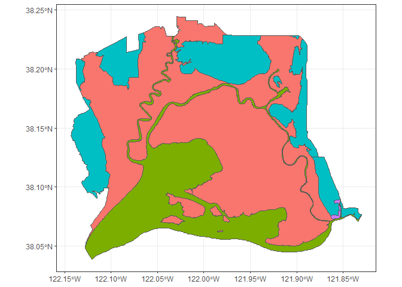

# Regions

All regions are derived from the united States Fish and Wildlife Service
[Enhanced Delta Smelt Monitoring
Program](https://www.fws.gov/lodi/juvenile_fish_monitoring_program/jfmp_index.htm).

## Regions

### EDSM 2016-17 Phase 1 Regions (Equivalent to 2017 Phases 2&3 Regions.)

``` r
ggplot(R_EDSM_Regions_1617P1)+
  geom_sf(aes(fill=Region))+
  theme_bw()+
  theme()
```


### EDSM 2017-18 Phase 1 Regions

``` r
ggplot(R_EDSM_Regions_1718P1)+
  geom_sf(aes(fill=Region))+
  theme_bw()+
  theme()
```


### EDSM 2018 Phases 2-3 Regions (Equivalent to 2019 Phase 2 and 2020 Phase 2-3 Regions)

``` r
ggplot(R_EDSM_Regions_18P23)+
  geom_sf(aes(fill=Region))+
  theme_bw()+
  theme()
```

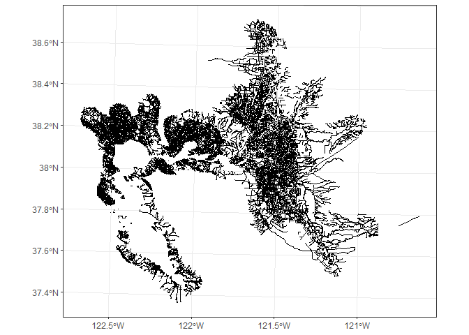

### EDSM 2018-19 Phase 1 Regions (Equivalent to 2019-2020 Phase 1 Regions)

``` r
ggplot(R_EDSM_Regions_1819P1)+
  geom_sf(aes(fill=Region))+
  theme_bw()+
  theme()
```

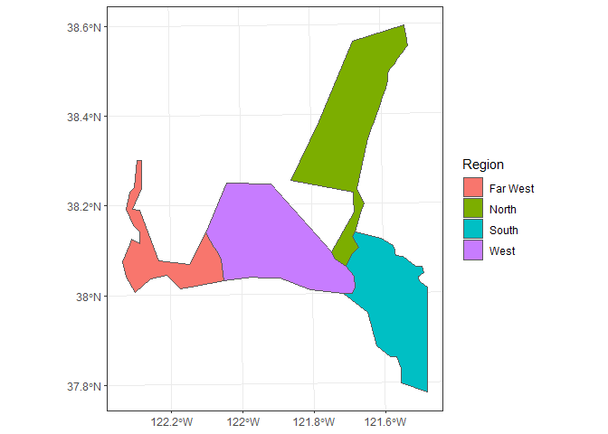

### EDSM 2019 Phase 3 Regions

``` r
ggplot(R_EDSM_Regions_19P3)+
  geom_sf(aes(fill=Region))+
  theme_bw()+
  theme()
```

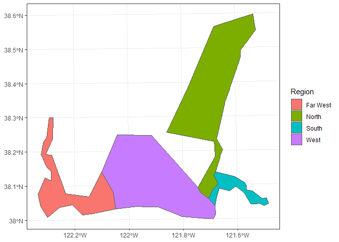

## Strata

### EDSM 2016-17 Phase 1 Strata

``` r
ggplot(R_EDSM_Strata_1617P1)+
  geom_sf(aes(fill=Stratum))+
  theme_bw()+
  theme()
```


### EDSM 2017 Phase 2 Strata

``` r
ggplot(R_EDSM_Strata_17P2)+
  geom_sf(aes(fill=Stratum))+
  theme_bw()+
  theme()
```

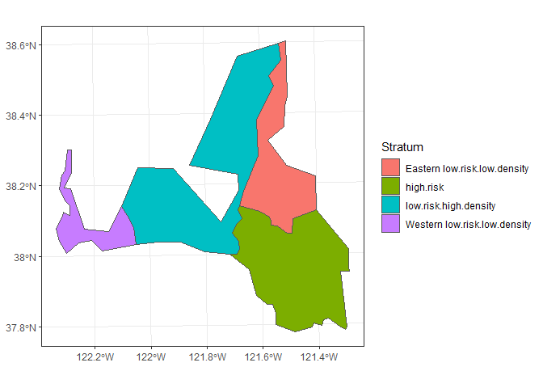

### EDSM 2017 Phase 3 Strata

``` r
ggplot(R_EDSM_Strata_17P3)+
  geom_sf(aes(fill=Stratum))+
  theme_bw()+
  theme()
```


### EDSM 2017-18 Phase 1 Strata

``` r
ggplot(R_EDSM_Strata_1718P1)+
  geom_sf(aes(fill=Stratum))+
  theme_bw()+
  theme()
```

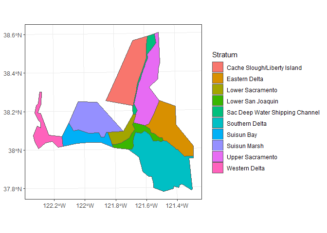

### EDSM 2018 Phases 2-3 Strata (Equivalent to 2019 Phase 2 and 2020 Phase 2-3 Strata)

``` r
ggplot(R_EDSM_Strata_18P23)+
  geom_sf(aes(fill=Stratum))+
  theme_bw()+
  theme()
```

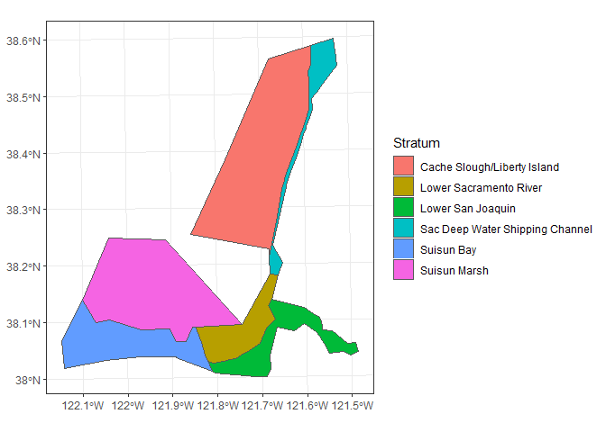

### EDSM 2018-19 Phase 1 Strata (Equivalent to 2019-2020 Phase 1 Strata)

``` r
ggplot(R_EDSM_Strata_1819P1)+
  geom_sf(aes(fill=Stratum))+
  theme_bw()+
  theme()
```

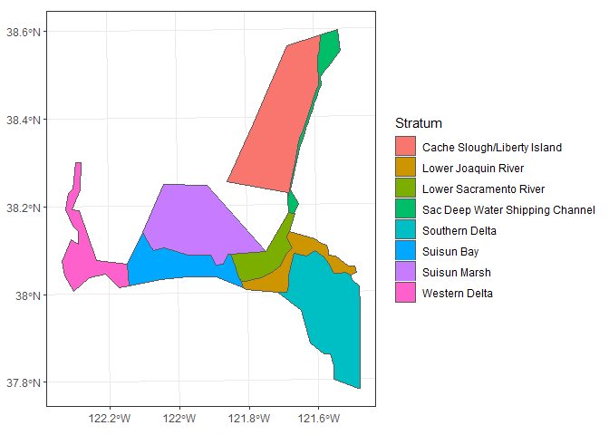

### EDSM 2019 Phase 3 Strata

``` r
ggplot(R_EDSM_Strata_19P3)+
  geom_sf(aes(fill=Stratum))+
  theme_bw()+
  theme()
```

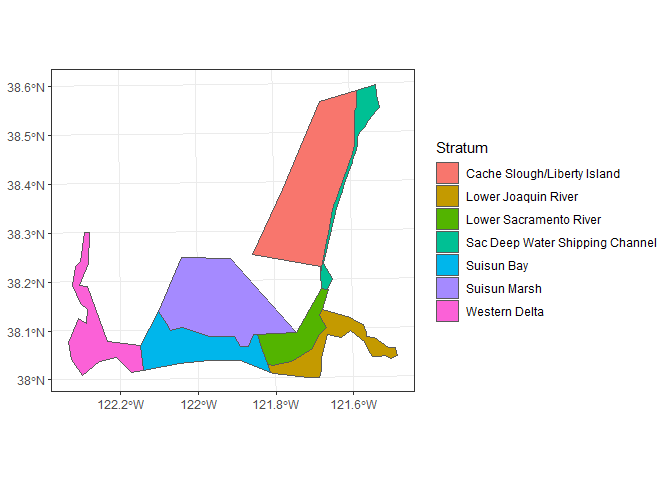

## Subregions

### EDSM 2016-17 Phase 1 Subregions (Equivalent to 2017 Phase 3 Subregions)

``` r
ggplot(R_EDSM_Subregions_1617P1)+
  geom_sf(aes(fill=SubRegion))+
  theme_bw()+
  theme(legend.position="none")
```


### EDSM 2017 Phase 2 Subregions

``` r
ggplot(R_EDSM_Subregions_17P2)+
  geom_sf(aes(fill=SubRegion))+
  theme_bw()+
  theme(legend.position="none")
```


### EDSM 2017-18 Phase 1 Subregions

``` r
ggplot(R_EDSM_Subregions_1718P1)+
  geom_sf(aes(fill=SubRegion))+
  theme_bw()+
  theme(legend.position="none")
```


### EDSM 2018 Phases 2-3 Subregions (Equivalent to 2019 Phase 2 and 2020 Phase 2-3 Subregions)

``` r
ggplot(R_EDSM_Subregions_18P23)+
  geom_sf(aes(fill=SubRegion))+
  theme_bw()+
  theme(legend.position="none")
```

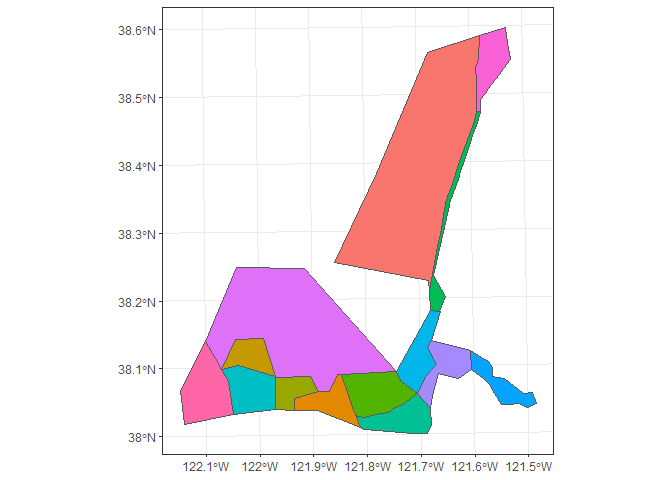

### EDSM 2018-19 Phase 1 Subregions (Equivalent to 2019-2020 Phase 1 Subregions)

``` r
ggplot(R_EDSM_Subregions_1819P1)+
  geom_sf(aes(fill=SubRegion))+
  theme_bw()+
  theme(legend.position="none")
```

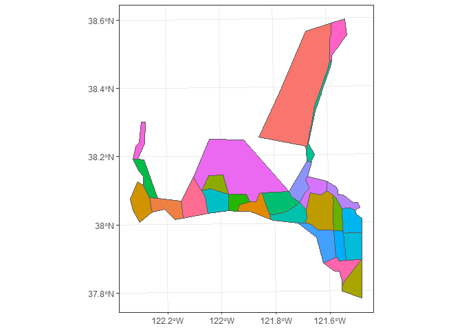

### EDSM 2019 Phase 3 Subregions

``` r
ggplot(R_EDSM_Subregions_19P3)+
  geom_sf(aes(fill=SubRegion))+
  theme_bw()+
  theme(legend.position="none")
```


### Brian Mahardja’s edited EDSM subregions

``` r
ggplot(R_EDSM_Subregions_Mahardja)+
  geom_sf(aes(fill=SubRegion))+
  theme_bw()+
  theme(legend.position="none")
```


# Habitat

## California aquatic resources inventory

San Francisco Estuary Institute (SFEI). 2017. “California Aquatic
Resource Inventory (CARI) version 0.3.” Accessed Aug 26, 2020.
<http://www.sfei.org/data/california-aquatic-resource-inventory-cari-version-03-gis-data>

### CARI wetlands

``` r
ggplot(H_CARI_wetlands) +
  geom_sf(aes(fill = leglabellevel1))+
  scale_fill_discrete(name="Wetland type", guide=guide_legend(ncol=1, title.position = "top", label.theme=element_text(size=8)))+
  theme_bw()+
  theme(legend.position = "bottom")
```

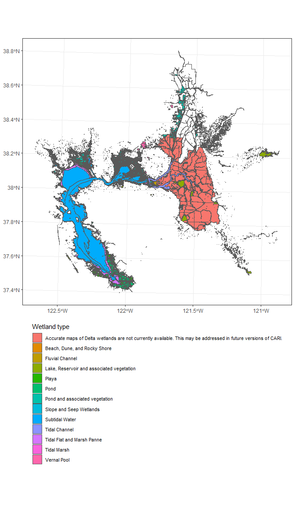

### CARI streams

``` r
ggplot(H_CARI_streams) +
  geom_sf()+
  theme_bw()
```


