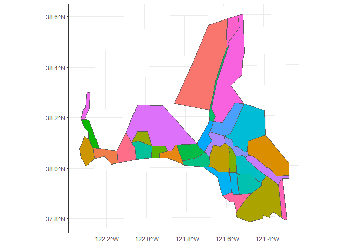
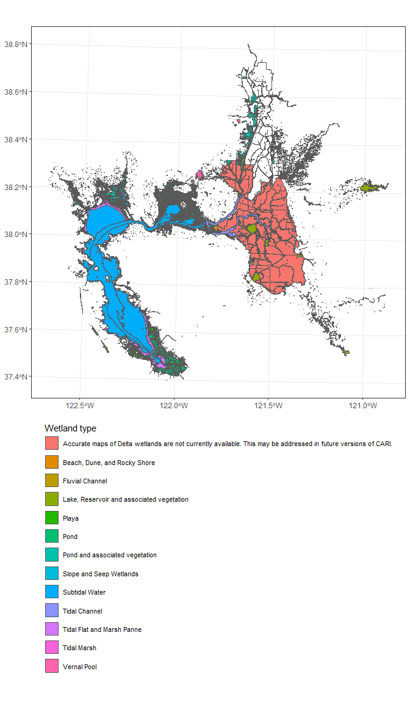

deltamapr
================

- <a href="#installation" id="toc-installation">Installation</a>
- <a href="#usage" id="toc-usage">Usage</a>
- <a href="#data-types" id="toc-data-types">Data types</a>
- <a href="#waterways" id="toc-waterways">Waterways</a>
  - <a href="#delta-waterways" id="toc-delta-waterways">Delta waterways</a>
  - <a href="#dbw-waterways" id="toc-dbw-waterways">DBW waterways</a>
  - <a href="#full-watershed-waterways"
    id="toc-full-watershed-waterways">Full watershed waterways</a>
- <a href="#regions" id="toc-regions">Regions</a>
  - <a href="#regions-1" id="toc-regions-1">Regions</a>
  - <a href="#strata" id="toc-strata">Strata</a>
  - <a href="#subregions" id="toc-subregions">Subregions</a>
- <a href="#habitat" id="toc-habitat">Habitat</a>
  - <a href="#california-aquatic-resources-inventory"
    id="toc-california-aquatic-resources-inventory">California aquatic
    resources inventory</a>

<!-- README.md is generated from README.Rmd. Please edit that file -->
<!-- badges: start -->

[](https://github.com/InteragencyEcologicalProgram/deltamapr/actions/workflows/R-CMD-check.yaml)
<!-- badges: end -->

The goal of deltamapr is to provide spatial data for the Bay-Delta.

## Installation

You can install the latest version from R-universe with:

``` r
options(repos = c(
    sbashevkin = 'https://sbashevkin.r-universe.dev',
    CRAN = 'https://cloud.r-project.org'))

install.packages("deltamapr")
```

Or from GitHub with:

``` r
# install.packages("devtools")
devtools::install_github("InteragencyEcologicalProgram/deltamapr")
```

## Usage

This package contains data objects stored in
[`sf`](https://r-spatial.github.io/sf/) format, which can be accessed
with:

``` r
require(sf) # To ensure `sf` objects print correctly
#> Loading required package: sf
#> Linking to GEOS 3.9.3, GDAL 3.5.2, PROJ 8.2.1; sf_use_s2() is TRUE
deltamapr::WW_Delta
#> Simple feature collection with 282 features and 9 fields
#> Geometry type: POLYGON
#> Dimension:     XY
#> Bounding box:  xmin: -122.6408 ymin: 37.41522 xmax: -120.9357 ymax: 38.67781
#> Geodetic CRS:  NAD83
#> # A tibble: 282 × 10
#>         AREA PERIMETER HYDRO_POLY HYDRO_PO_1 HYDRO_24K_ TYPE  HNAME   Shape_Leng
#>        <dbl>     <dbl>      <int>      <int>      <int> <chr> <chr>        <dbl>
#>  1 73544304   1033340         791        797        798 MR    SACRAM…    2.45   
#>  2    87637.     3319.       1965       1963       1964 S     W          0.0357 
#>  3  7915130     87428.       1967       1965       1966 C     SACTO.…    0.829  
#>  4   103906      2719.       1970       1969       1970 L     GREENS…    0.0264 
#>  5   106371      2798.       1977       1974       1975 L     LAKE W…    0.0283 
#>  6   159485      3392.       1982       1978       1979 S     W          0.0314 
#>  7    42597.     1003.       1992       1989       1990 S     W          0.00952
#>  8     5648.      498.       2001       2008       2009 MR    SOUTH …    0.00548
#>  9     4139.      502.       2006       2012       2013 MR    SOUTH …    0.00536
#> 10    97840.     6630.       2008       2011       2012 MR    SOUTH …    0.0746 
#> # ℹ 272 more rows
#> # ℹ 2 more variables: Shape_Area <dbl>, geometry <POLYGON [°]>
```

Or, after loading the package, like this:

``` r
require(deltamapr)
#> Loading required package: deltamapr
WW_Delta
#> Simple feature collection with 282 features and 9 fields
#> Geometry type: POLYGON
#> Dimension:     XY
#> Bounding box:  xmin: -122.6408 ymin: 37.41522 xmax: -120.9357 ymax: 38.67781
#> Geodetic CRS:  NAD83
#> # A tibble: 282 × 10
#>         AREA PERIMETER HYDRO_POLY HYDRO_PO_1 HYDRO_24K_ TYPE  HNAME   Shape_Leng
#>        <dbl>     <dbl>      <int>      <int>      <int> <chr> <chr>        <dbl>
#>  1 73544304   1033340         791        797        798 MR    SACRAM…    2.45   
#>  2    87637.     3319.       1965       1963       1964 S     W          0.0357 
#>  3  7915130     87428.       1967       1965       1966 C     SACTO.…    0.829  
#>  4   103906      2719.       1970       1969       1970 L     GREENS…    0.0264 
#>  5   106371      2798.       1977       1974       1975 L     LAKE W…    0.0283 
#>  6   159485      3392.       1982       1978       1979 S     W          0.0314 
#>  7    42597.     1003.       1992       1989       1990 S     W          0.00952
#>  8     5648.      498.       2001       2008       2009 MR    SOUTH …    0.00548
#>  9     4139.      502.       2006       2012       2013 MR    SOUTH …    0.00536
#> 10    97840.     6630.       2008       2011       2012 MR    SOUTH …    0.0746 
#> # ℹ 272 more rows
#> # ℹ 2 more variables: Shape_Area <dbl>, geometry <POLYGON [°]>
```

## Data types

Three spatial data types are included in this package

1)  **Waterways**: Shapefiles of water coverage. These data files are
    preceded by the prefix *WW*.
2)  **Regions**: Shapefiles with sets of regions, subregions, or strata.
    These data files are preceded by the prefix *R*.
3)  **Habitat**: Shapefiles with habitat data. These data files are
    preceded by the prefix *H*.

# Waterways

``` r
require(ggplot2)
require(sf)
```

## Delta waterways

Supplied by the California Department of Fish and Wildlife and created
by the USBR MPGIS Service Center via digitizing from 7.5 minute USGS
quat sheets.

``` r
ggplot(WW_Delta)+
  geom_sf()+
  theme_bw()
```


## DBW waterways

Produced by the California State Parks Division of Boating and Waterways

``` r
ggplot(WW_DBW)+
  geom_sf()+
  theme_bw()
```


## Full watershed waterways

This shapefile includes data from CH2M Hill, and Wetland and Water
Resources, CDFG Ecosystem Restoration Program as a part of ERP Stage 2
conservation strategy, and Dan Gillenwater.

``` r
ggplot(WW_Watershed)+
  geom_sf()+
  theme_bw()
```


# Regions

Most regions are derived from the united States Fish and Wildlife
Service [Enhanced Delta Smelt Monitoring
Program](https://www.fws.gov/lodi/juvenile_fish_monitoring_program/jfmp_index.htm)
(EDSM).

## Regions

### Legal Delta Boundary

The legal Delta boundary as
[published](https://data.cnra.ca.gov/dataset/i03-legaldeltaboundary1) by
the California Department of Water Resources

``` r
ggplot(R_Delta)+
  geom_sf(fill="darkorchid4")+
  theme_bw()
```


### Suisun Marsh Boundary

The Suisun Marsh boundary as
[published](https://data.cnra.ca.gov/dataset/i03-suisunmarshboundary1)
by the California Department of Water Resources

``` r
ggplot(R_Suisun)+
  geom_sf(aes(fill=LOCATION))+
  theme_bw()+
  theme(legend.position="none")
```


### EDSM 2016-17 Phase 1 Regions (Equivalent to 2017 Phases 2&3 Regions.)

``` r
ggplot(R_EDSM_Regions_1617P1)+
  geom_sf(aes(fill=Region))+
  theme_bw()
```


### EDSM 2017-18 Phase 1 Regions

``` r
ggplot(R_EDSM_Regions_1718P1)+
  geom_sf(aes(fill=Region))+
  theme_bw()
```


### EDSM 2018 Phases 2-3 Regions (Equivalent to 2019 Phase 2 and 2020 Phase 2-3 Regions)

``` r
ggplot(R_EDSM_Regions_18P23)+
  geom_sf(aes(fill=Region))+
  theme_bw()+
  theme()
```


### EDSM 2018-19 Phase 1 Regions (Equivalent to 2019-2020 Phase 1 Regions)

``` r
ggplot(R_EDSM_Regions_1819P1)+
  geom_sf(aes(fill=Region))+
  theme_bw()
```


### EDSM 2019 Phase 3 Regions

``` r
ggplot(R_EDSM_Regions_19P3)+
  geom_sf(aes(fill=Region))+
  theme_bw()
```


## Strata

### EDSM 2016-17 Phase 1 Strata

``` r
ggplot(R_EDSM_Strata_1617P1)+
  geom_sf(aes(fill=Stratum))+
  theme_bw()+
  theme()
```


### EDSM 2017 Phase 2 Strata

``` r
ggplot(R_EDSM_Strata_17P2)+
  geom_sf(aes(fill=Stratum))+
  theme_bw()
```


### EDSM 2017 Phase 3 Strata

``` r
ggplot(R_EDSM_Strata_17P3)+
  geom_sf(aes(fill=Stratum))+
  theme_bw()
```


### EDSM 2017-18 Phase 1 Strata

``` r
ggplot(R_EDSM_Strata_1718P1)+
  geom_sf(aes(fill=Stratum))+
  theme_bw()
```


### EDSM 2018 Phases 2-3 Strata (Equivalent to 2019 Phase 2 and 2020 Phase 2-3 Strata)

``` r
ggplot(R_EDSM_Strata_18P23)+
  geom_sf(aes(fill=Stratum))+
  theme_bw()
```


### EDSM 2018-19 Phase 1 Strata (Equivalent to 2019-2020 Phase 1 Strata)

``` r
ggplot(R_EDSM_Strata_1819P1)+
  geom_sf(aes(fill=Stratum))+
  theme_bw()
```


### EDSM 2019 Phase 3 Strata

``` r
ggplot(R_EDSM_Strata_19P3)+
  geom_sf(aes(fill=Stratum))+
  theme_bw()
```


## Subregions

### EDSM 2016-17 Phase 1 Subregions (Equivalent to 2017 Phase 3 Subregions)

``` r
ggplot(R_EDSM_Subregions_1617P1)+
  geom_sf(aes(fill=SubRegion))+
  theme_bw()+
  theme(legend.position="none")
```


### EDSM 2017 Phase 2 Subregions

``` r
ggplot(R_EDSM_Subregions_17P2)+
  geom_sf(aes(fill=SubRegion))+
  theme_bw()+
  theme(legend.position="none")
```


### EDSM 2017-18 Phase 1 Subregions

``` r
ggplot(R_EDSM_Subregions_1718P1)+
  geom_sf(aes(fill=SubRegion))+
  theme_bw()+
  theme(legend.position="none")
```



### EDSM 2018 Phases 2-3 Subregions (Equivalent to 2019 Phase 2 and 2020 Phase 2-3 Subregions)

``` r
ggplot(R_EDSM_Subregions_18P23)+
  geom_sf(aes(fill=SubRegion))+
  theme_bw()+
  theme(legend.position="none")
```


### EDSM 2018-19 Phase 1 Subregions (Equivalent to 2019-2020 Phase 1 Subregions)

``` r
ggplot(R_EDSM_Subregions_1819P1)+
  geom_sf(aes(fill=SubRegion))+
  theme_bw()+
  theme(legend.position="none")
```


### EDSM 2019 Phase 3 Subregions

``` r
ggplot(R_EDSM_Subregions_19P3)+
  geom_sf(aes(fill=SubRegion))+
  theme_bw()+
  theme(legend.position="none")
```


### Brian Mahardja’s edited EDSM subregions

``` r
ggplot(R_EDSM_Subregions_Mahardja)+
  geom_sf(aes(fill=SubRegion))+
  theme_bw()+
  theme(legend.position="none")
```


### Modified version of Brian Mahardja’s edited EDSM subregions

This version was created for use by the IEP FLOAT/Drought MAST analyses
in 2021. The “Georgiana Slough” and “Sacramento River near Ryde”
SubRegions were merged, retaining the “Sacramento River near Ryde” name.

``` r
ggplot(R_EDSM_Subregions_Mahardja_FLOAT)+
  geom_sf(aes(fill=SubRegion))+
  theme_bw()+
  theme(legend.position="none")
```


### SubRegions from the Delta Smelt individual based model

This shapefile was created by Flow West, Rose et al. 2013, and Peterson
et al. 2019. Peterson, J., E. McCreless, A. Duarte, S. Hamilton, and J.
Medellin-Azuara. 2019. Structured Decision Making for Scientific
Management in the San Francisco Bay-Delta. Draft progress report, US
Bureau of Reclamation, Sacramento, CA. Data available on:
<https://github.com/CSAMP/delta-secchi-temperature-data>. Rose, K. A.,
W. J. Kimmerer, K. P. Edwards, and W. A. Bennett. 2013. Individual-Based
Modeling of Delta Smelt Population Dynamics in the Upper San Francisco
Estuary: I. Model Description and Baseline Results. Transactions of the
American Fisheries Society 142:1238–1259.

``` r
ggplot(R_DSIBM)+
  geom_sf(aes(fill=SUBREGION))+
  theme_bw()+
  theme(legend.position="none")
```


# Habitat

## California aquatic resources inventory

San Francisco Estuary Institute (SFEI). 2017. “California Aquatic
Resource Inventory (CARI) version 0.3.” Accessed Aug 26, 2020.
<http://www.sfei.org/data/california-aquatic-resource-inventory-cari-version-03-gis-data>

### CARI wetlands

``` r
ggplot(H_CARI_wetlands) +
  geom_sf(aes(fill = leglabellevel1))+
  scale_fill_discrete(name="Wetland type", guide=guide_legend(ncol=1, title.position = "top", label.theme=element_text(size=8)))+
  theme_bw()+
  theme(legend.position = "bottom")
```



### CARI streams

``` r
ggplot(H_CARI_streams) +
  geom_sf()+
  theme_bw()
```


