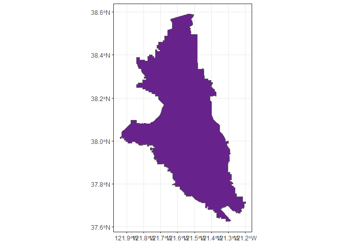

<!-- README.md is generated from README.Rmd. Please edit that file -->

# deltamapr

<!-- badges: start -->

[](https://github.com/InteragencyEcologicalProgram/deltamapr/actions)
<!-- badges: end -->

The goal of deltamapr is to provide spatial data for the Bay-Delta.

## Installation

You can install the development version from
[GitHub](https://github.com/) with:

``` r
# install.packages("devtools")
devtools::install_github("InteragencyEcologicalProgram/deltamapr")
```

## Usage

This package contains data objects stored in
[`sf`](https://r-spatial.github.io/sf/) format, which can be accessed
with:

``` r
require(sf) # To ensure `sf` objects print correctly
#> Loading required package: sf
#> Linking to GEOS 3.8.0, GDAL 3.0.4, PROJ 6.3.1
deltamapr::WW_Delta
#> Simple feature collection with 282 features and 9 fields
#> geometry type:  POLYGON
#> dimension:      XY
#> bbox:           xmin: -122.6408 ymin: 37.41522 xmax: -120.9357 ymax: 38.67781
#> geographic CRS: NAD83
#> # A tibble: 282 x 10
#>      AREA PERIMETER HYDRO_POLY HYDRO_PO_1 HYDRO_24K_ TYPE  HNAME Shape_Leng
#>     <dbl>     <dbl>      <int>      <int>      <int> <chr> <chr>      <dbl>
#>  1 7.35e7  1033340         791        797        798 MR    SACR~    2.45   
#>  2 8.76e4     3319.       1965       1963       1964 S     W        0.0357 
#>  3 7.92e6    87428.       1967       1965       1966 C     SACT~    0.829  
#>  4 1.04e5     2719.       1970       1969       1970 L     GREE~    0.0264 
#>  5 1.06e5     2798.       1977       1974       1975 L     LAKE~    0.0283 
#>  6 1.59e5     3392.       1982       1978       1979 S     W        0.0314 
#>  7 4.26e4     1003.       1992       1989       1990 S     W        0.00952
#>  8 5.65e3      498.       2001       2008       2009 MR    SOUT~    0.00548
#>  9 4.14e3      502.       2006       2012       2013 MR    SOUT~    0.00536
#> 10 9.78e4     6630.       2008       2011       2012 MR    SOUT~    0.0746 
#> # ... with 272 more rows, and 2 more variables: Shape_Area <dbl>,
#> #   geometry <POLYGON [°]>
```

Or, after loading the package, like this:

``` r
require(deltamapr)
#> Loading required package: deltamapr
WW_Delta
#> Simple feature collection with 282 features and 9 fields
#> geometry type:  POLYGON
#> dimension:      XY
#> bbox:           xmin: -122.6408 ymin: 37.41522 xmax: -120.9357 ymax: 38.67781
#> geographic CRS: NAD83
#> # A tibble: 282 x 10
#>      AREA PERIMETER HYDRO_POLY HYDRO_PO_1 HYDRO_24K_ TYPE  HNAME Shape_Leng
#>     <dbl>     <dbl>      <int>      <int>      <int> <chr> <chr>      <dbl>
#>  1 7.35e7  1033340         791        797        798 MR    SACR~    2.45   
#>  2 8.76e4     3319.       1965       1963       1964 S     W        0.0357 
#>  3 7.92e6    87428.       1967       1965       1966 C     SACT~    0.829  
#>  4 1.04e5     2719.       1970       1969       1970 L     GREE~    0.0264 
#>  5 1.06e5     2798.       1977       1974       1975 L     LAKE~    0.0283 
#>  6 1.59e5     3392.       1982       1978       1979 S     W        0.0314 
#>  7 4.26e4     1003.       1992       1989       1990 S     W        0.00952
#>  8 5.65e3      498.       2001       2008       2009 MR    SOUT~    0.00548
#>  9 4.14e3      502.       2006       2012       2013 MR    SOUT~    0.00536
#> 10 9.78e4     6630.       2008       2011       2012 MR    SOUT~    0.0746 
#> # ... with 272 more rows, and 2 more variables: Shape_Area <dbl>,
#> #   geometry <POLYGON [°]>
```

## Data types

Three spatial data types are included in this package

1)  **Waterways**: Shapefiles of water coverage. These data files are
    preceded by the prefix *WW*.
2)  **Regions**: Shapefiles with sets of regions, subregions, or strata.
    These data files are preceded by the prefix *R*.
3)  **Habitat**: Shapefiles with habitat data. These data files are
    preceded by the prefix *H*.

## Included data sets

``` r
require(ggplot2)
require(sf)
```

### Delta waterways

``` r
ggplot(WW_Delta)+
  geom_sf()+
  theme_bw()
```



### Full watershed waterways

``` r
ggplot(WW_Watershed)+
  geom_sf()+
  theme_bw()
```


### Delta regions

``` r
ggplot(R_EDSM_Subregions_Mahardja)+
  geom_sf(aes(fill=SubRegion))+
  theme_bw()+
  theme(legend.position="none")
```


### [California aquatic resources inventory](https://www.sfei.org/data/california-aquatic-resource-inventory-cari-version-03-gis-data#sthash.zuIpGDaQ.dpbs)

#### CARI wetlands

``` r
ggplot(H_CARI_wetlands) +
  geom_sf(aes(fill = leglabellevel1))+
  scale_fill_discrete(name="Wetland type", guide=guide_legend(ncol=1, title.position = "top", label.theme=element_text(size=8)))+
  theme_bw()+
  theme(legend.position = "bottom")
```


#### CARI streams

``` r
ggplot(H_CARI_streams) +
  geom_sf()+
  theme_bw()
```


