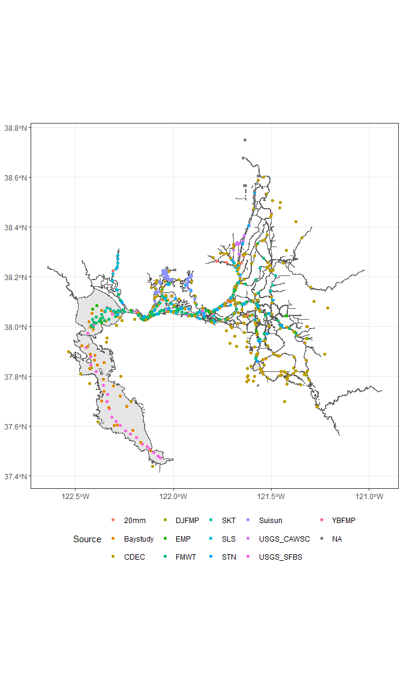

deltamapr
================

- [Installation](#installation)
- [Usage](#usage)
- [Data types](#data-types)
- [Waterways](#waterways)
  - [Delta waterways](#delta-waterways)
  - [DBW waterways](#dbw-waterways)
  - [Full watershed waterways](#full-watershed-waterways)
  - [Canals](#canals)
- [Regions](#regions)
  - [Regions](#regions-1)
  - [Strata](#strata)
  - [Subregions](#subregions)
- [Habitat](#habitat)
  - [California aquatic resources
    inventory](#california-aquatic-resources-inventory)
- [Point data](#point-data)
  - [Stations from IEP’s long term monitoring
    surveys](#stations-from-ieps-long-term-monitoring-surveys)
  - [River Kilometer indexes](#river-kilometer-indexes)
  - [X2 Locations](#x2-locations)

<!-- README.md is generated from README.Rmd. Please edit that file -->
<!-- badges: start -->

[](https://github.com/InteragencyEcologicalProgram/deltamapr/actions/workflows/R-CMD-check.yaml)
<!-- badges: end -->

The goal of deltamapr is to provide spatial data for the Bay-Delta.

## Installation

You can install the latest version from R-universe with:

``` r
options(repos = c(
    sbashevkin = 'https://sbashevkin.r-universe.dev',
    CRAN = 'https://cloud.r-project.org'))

install.packages("deltamapr")
```

Or from GitHub with:

``` r
# install.packages("devtools")
devtools::install_github("InteragencyEcologicalProgram/deltamapr")
```

## Usage

This package contains data objects stored in
[`sf`](https://r-spatial.github.io/sf/) format, which can be accessed
with:

``` r
require(sf) # To ensure `sf` objects print correctly
#> Loading required package: sf
#> Linking to GEOS 3.12.1, GDAL 3.8.4, PROJ 9.3.1; sf_use_s2() is TRUE
deltamapr::WW_Delta
#> Simple feature collection with 282 features and 9 fields
#> Geometry type: POLYGON
#> Dimension:     XY
#> Bounding box:  xmin: -122.6408 ymin: 37.41522 xmax: -120.9357 ymax: 38.67781
#> Geodetic CRS:  NAD83
#>             AREA   PERIMETER HYDRO_POLY HYDRO_PO_1 HYDRO_24K_ TYPE
#> 1   7.354430e+07 1033340.000        791        797        798   MR
#> 2   8.763730e+04    3319.230       1965       1963       1964    S
#> 3   7.915130e+06   87427.898       1967       1965       1966    C
#> 4   1.039060e+05    2718.730       1970       1969       1970    L
#> 5   1.063710e+05    2798.310       1977       1974       1975    L
#> 6   1.594850e+05    3391.720       1982       1978       1979    S
#> 7   4.259720e+04    1002.740       1992       1989       1990    S
#> 8   5.647520e+03     498.471       2001       2008       2009   MR
#> 9   4.138630e+03     502.121       2006       2012       2013   MR
#> 10  9.783990e+04    6630.260       2008       2011       2012   MR
#> 11  3.917140e+04    2702.780       2009       2014       2015   MR
#> 12  2.245740e+05    4420.540       2012       2018       2019    L
#> 13  5.450720e+04    2544.130       2023       2023       2024    S
#> 14  1.187570e+05    5915.390       2026       2025       2026    S
#> 15  5.230930e+04    4285.400       2040       2031       2032    S
#> 16  1.222320e+04     568.842       2041       2032       2033    S
#> 17  4.201850e+04    1925.320       2044       2036       2037    S
#> 18  1.353150e+05    9351.990       2045       2038       2039    S
#> 19  3.061950e+05    6198.590       2062       2048       2049    L
#> 20  4.479720e+05   20187.801       2066       2051       2052    S
#> 21  8.060010e+04    2737.160       2070       2054       2055    L
#> 22  2.344820e+04    2002.160       2071       2055       2056    C
#> 23  6.705170e+05   30442.801       2075       2070       2071    S
#> 24  1.830240e+06   97319.898       2079       2078       2079   MR
#> 25  4.606480e+05    6880.080       2080       2072       2073    L
#> 26  3.200640e+04    3064.700       2083       2077       2078    S
#> 27  3.363250e+05   22591.900       2089       2082       2083    S
#> 28  1.313500e+06   20976.900       2097       2087       2088    L
#> 29  6.412640e+04    3387.490       2103       2086       2087    S
#> 30  8.701560e+03     605.233       2106       2094       2095    L
#> 31  1.176070e+06   23707.600       2109       2098       2099    S
#> 32  2.040900e+04    1812.820       2110       2100       2101    S
#> 33  5.712080e+04    3805.980       2118       2110       2111    S
#> 34  3.657280e+04     974.053       2121       2113       2114    L
#> 35  8.581800e+04    1565.620       2124       2122       2123    L
#> 36  5.364940e+05   18017.600       2132       2121       2122    S
#> 37  3.678340e+04    1203.770       2133       2126       2127    L
#> 38  1.380380e+04     642.026       2134       2123       2124    S
#> 39  3.827690e+03     223.892       2135       2125       2126    S
#> 40  4.450580e+04    2707.720       2137       2130       2131    S
#> 41  5.727650e+05   21390.801       2138       2127       2128    S
#> 42  9.056870e+04    6156.310       2145       2131       2132    S
#> 43  8.263340e+03     361.349       2146       2133       2134    S
#> 44  2.033840e+04     583.979       2147       2137       2138    S
#> 45  2.164000e+04    1582.560       2150       2136       2137    S
#> 46  4.274140e+05   12551.800       2151       2138       2139    S
#> 47  6.189630e+03     353.717       2152       2141       2142    S
#> 48  2.211710e+06   74846.898       2153       2145       2146    S
#> 49  1.842030e+03     183.372       2155       2146       2147    S
#> 50  1.125030e+04    1238.370       2156       2149       2150    S
#> 51  6.900710e+04    4572.880       2157       2147       2148    S
#> 52  8.440660e+03     582.682       2159       2150       2151    S
#> 53  9.819270e+04    2937.670       2160       2148       2149    S
#> 54  1.047390e+05    6737.600       2164       2161       2162    S
#> 55  1.270000e+05    8934.000       2168       2153       2154    S
#> 56  1.719230e+04    1993.590       2169       2158       2159    S
#> 57  5.199290e+06   51751.801       2173       2156       2157    S
#> 58  7.525220e+03     845.223       2174       2166       2167    S
#> 59  9.865940e+03     582.799       2176       2164       2165    L
#> 60  1.433060e+07   84121.297       2180       2142       2143   MR
#> 61  7.324830e+03     807.327       2182       2174       2175    S
#> 62  2.252180e+06   41082.602       2184       2176       2177    S
#> 63  5.152660e+03     283.940       2194       2184       2185    S
#> 64  1.942460e+04     843.466       2195       2185       2186    S
#> 65  7.458520e+05   26447.699       2203       2195       2196    S
#> 66  1.931310e+04    1448.670       2206       2193       2194    S
#> 67  1.386810e+05    8761.120       2211       2194       2195    S
#> 68  1.797190e+06   23564.699       2213       2199       2200    S
#> 69  8.611630e+03     445.882       2220       2214       2215    S
#> 70  5.971250e+03     411.834       2221       2213       2214    S
#> 71  2.838280e+05   15066.500       2223       2204       2205    S
#> 72  6.495030e+03     418.192       2225       2217       2218    S
#> 73  1.201210e+04    1083.540       2228       2221       2222    S
#> 74  1.190640e+05    3202.600       2234       2225       2226    S
#> 75  1.454990e+05    1625.840       2237       2228       2229    S
#> 76  6.969670e+04    2614.110       2240       2240       2241    S
#> 77  2.158650e+04     784.664       2242       2244       2245    S
#> 78  1.062230e+05   11177.000       2244       2230       2231    S
#> 79  1.002810e+03     146.346       2246       2249       2250    S
#> 80  5.490610e+04    1737.950       2247       2253       2254    S
#> 81  2.638750e+03     203.825       2253       2264       2265    S
#> 82  1.343920e+04     691.496       2255       2266       2267    S
#> 83  2.554440e+06  150133.000       2258       2270       2271   MR
#> 84  1.276520e+06   26864.600       2260       2236       2237    S
#> 85  2.439110e+05   14583.200       2264       2241       2242    S
#> 86  1.034530e+06   40248.199       2274       2215       2216   MR
#> 87  5.123350e+04    2155.860       2277       2262       2263    S
#> 88  7.670230e+04    6042.690       2280       2288       2289    S
#> 89  4.388310e+04    2228.210       2282       2271       2272    S
#> 90  7.811200e+04    6431.620       2284       2292       2293    S
#> 91  7.635880e+04    3312.730       2292       2281       2282    S
#> 92  1.274500e+05    2643.380       2297       2301       2302    S
#> 93  1.252830e+06   40236.801       2314       2314       2315    S
#> 94  4.222000e+06   58142.699       2315       2290       2291    S
#> 95  6.150030e+04    2407.880       2318       2322       2323    S
#> 96  4.104300e+06   67628.602       2324       2255       2256   MR
#> 97  2.690790e+04    3356.370       2328       2321       2322    S
#> 98  1.112230e+05    9345.630       2332       2328       2329    S
#> 99  1.457070e+06   33340.801       2339       2348       2349   MR
#> 100 3.332910e+06   59971.398       2342       2352       2353   MR
#> 101 4.069000e+05   22066.199       2345       2320       2321    S
#> 102 1.790460e+05   11350.400       2347       2319       2320    S
#> 103 1.796930e+05    6770.750       2357       2339       2340    S
#> 104 2.458770e+05   12377.500       2363       2347       2348    S
#> 105 6.920420e+04    2786.640       2367       2351       2352    S
#> 106 5.966850e+04    3642.280       2374       2371       2372    S
#> 107 1.685230e+05   11358.600       2376       2362       2363    S
#> 108 5.941800e+05   46361.699       2377       2356       2357    S
#> 109 1.118800e+06   28404.199       2379       2374       2375    S
#> 110 3.216320e+05   13955.700       2380       2403       2404    S
#> 111 2.919230e+04    1526.440       2384       2382       2383    S
#> 112 2.094280e+05   11043.800       2387       2360       2361    S
#> 113 3.885990e+05   11449.100       2389       2365       2366    S
#> 114 5.762480e+04    4086.460       2393       2384       2385    S
#> 115 6.099690e+04    3776.520       2397       2389       2390    S
#> 116 8.856040e+05   30279.301       2403       2386       2387    S
#> 117 2.751300e+05   13989.100       2405       2404       2405    S
#> 118 1.619830e+04    1477.870       2407       2412       2413    S
#> 119 9.261410e+04    6887.420       2408       2409       2410    S
#> 120 1.216390e+05    4233.760       2409       2411       2412    S
#> 121 3.153660e+04    2889.390       2410       2413       2414    S
#> 122 2.235780e+04    1696.420       2411       2415       2416    S
#> 123 7.138870e+04    5441.520       2414       2401       2402    S
#> 124 6.731260e+04    3550.850       2416       2418       2419    S
#> 125 5.215360e+06   77164.500       2417       2416       2417    S
#> 126 3.394430e+05    2736.490       2421       2429       2430    L
#> 127 8.916610e+04    3444.580       2423       2426       2427    S
#> 128 8.595860e+04    7488.390       2424       2417       2418    S
#> 129 1.860300e+05    7427.920       2426       2428       2429    S
#> 130 2.892100e+05    9614.670       2432       2427       2428    S
#> 131 1.496980e+05   10812.800       2433       2423       2424    S
#> 132 3.959210e+05   12244.800       2437       2454       2455    S
#> 133 7.750790e+04    7067.110       2443       2433       2434    S
#> 134 4.795020e+04    1977.890       2455       2450       2451    S
#> 135 1.307240e+04    1185.530       2461       2448       2449    S
#> 136 2.815680e+05   17151.100       2464       2437       2438    S
#> 137 4.024240e+05   15617.800       2469       2462       2463    S
#> 138 6.350730e+05   29725.301       2470       2442       2443    S
#> 139 6.465300e+04    1158.070       2485       2496       2497    S
#> 140 8.184630e+05   17753.400       2489       2512       2513    S
#> 141 2.869580e+08  106110.000       2496       2472       2473    L
#> 142 5.022630e+04    6118.880       2510       2515       2516    S
#> 143 9.302010e+04    6908.350       2512       2497       2498    S
#> 144 1.059270e+08  153358.000       2517       2506       2507    L
#> 145 3.666870e+05   12988.700       2518       2491       2492    S
#> 146 1.730360e+06   15425.700       2523       2541       2542   MR
#> 147 2.306310e+05   17368.301       2532       2521       2522    S
#> 148 4.173950e+05   20049.400       2543       2549       2550    S
#> 149 1.100190e+06   19499.699       2553       2564       2565    S
#> 150 9.577600e+05   12224.300       2559       2560       2561    S
#> 151 1.969920e+06   35723.500       2569       2588       2589    S
#> 152 4.770490e+07  547759.000       2570       2575       2576   MR
#> 153 1.539850e+04    1256.460       2576       2566       2567    S
#> 154 2.083840e+05   11212.200       2577       2563       2564    S
#> 155 1.612440e+05    9428.340       2578       2570       2571    S
#> 156 1.328170e+06    9769.770       2580       2584       2585    S
#> 157 1.753400e+05    9810.630       2581       2571       2572    S
#> 158 5.708590e+04    1648.520       2583       2574       2575    S
#> 159 1.977360e+05    5737.770       2595       2592       2593    S
#> 160 1.753400e+06   23020.801       2596       2612       2613    S
#> 161 7.278110e+04    5796.020       2602       2595       2596    S
#> 162 4.039300e+04    3238.620       2607       2599       2600    S
#> 163 8.968110e+04    6310.160       2614       2601       2602    S
#> 164 4.037360e+05    8810.720       2622       2646       2647    S
#> 165 9.506010e+06   36703.602       2623       2610       2611    S
#> 166 3.859120e+05    8570.890       2626       2629       2630    S
#> 167 2.381380e+04    2117.660       2631       2613       2614    S
#> 168 1.614210e+05    6877.220       2650       2658       2659    S
#> 169 1.113870e+07  231023.000       2655       2655       2656   MR
#> 170 5.868400e+05    6879.190       2661       2661       2662    S
#> 171 1.812160e+05    3255.550       2669       2666       2667    S
#> 172 1.898140e+07   36292.500       2670       2637       2638    L
#> 173 1.593870e+05    6106.690       2672       2652       2653   MR
#> 174 2.251650e+06   26556.000       2677       2672       2673   MR
#> 175 2.852500e+04     624.284       2693       2665       2666    S
#> 176 3.932320e+05   10458.400       2699       2679       2680    S
#> 177 1.923750e+06   48215.898       2705       2710       2711    S
#> 178 7.428930e+06   62248.898       2711       2690       2691    L
#> 179 7.330740e+05   17020.301       2714       2699       2700    S
#> 180 2.451010e+05    7235.690       2731       2700       2701    S
#> 181 6.715980e+04    6416.820       2736       2749       2750    S
#> 182 6.062530e+05   16793.600       2753       2727       2728    S
#> 183 1.099230e+05    7187.050       2759       2777       2778   MR
#> 184 2.405860e+05   16367.800       2762       2781       2782    S
#> 185 1.479420e+06   48622.500       2779       2784       2785    S
#> 186 6.891240e+06  131079.000       2787       2776       2777   MR
#> 187 5.431870e+04    3403.720       2805       2732       2733    S
#> 188 1.010050e+05    2340.910       2824       2816       2817    S
#> 189 8.472890e+05    7275.670       2826       2751       2752    S
#> 190 6.285890e+04    4180.970       2832       2833       2834    S
#> 191 5.020380e+04    3096.450       2840       2822       2823    S
#> 192 1.719630e+05    8417.250       2845       2794       2795    S
#> 193 5.601990e+05   13882.900       2853       2825       2826    S
#> 194 1.160590e+06   26206.699       2854       2827       2828    S
#> 195 4.651160e+04    1491.550       2862       2839       2840    S
#> 196 2.333270e+05    4140.980       2869       2847       2848    S
#> 197 1.362920e+06   25238.000       2875       2836       2837    S
#> 198 5.985620e+06   17007.400       2884       2843       2844    S
#> 199 1.056010e+05    7165.710       2885       2861       2862    S
#> 200 2.315750e+05   15315.300       2886       2862       2863    S
#> 201 2.854850e+04    1497.650       2893       2865       2866    S
#> 202 2.523530e+05    4173.830       2896       2844       2845    S
#> 203 2.747820e+05    3552.990       2903       2866       2867    S
#> 204 9.457590e+05   18584.301       2904       2876       2877    S
#> 205 7.588480e+04    5447.640       2907       2889       2890    S
#> 206 4.664430e+04    1900.710       2910       2864       2865    S
#> 207 4.512150e+04    4408.920       2921       2880       2881   MR
#> 208 5.609710e+04    3184.060       2934       2888       2889    S
#> 209 7.412580e+04    2815.360       2946       2886       2887    L
#> 210 4.254360e+04    3373.170       2967       2927       2928    S
#> 211 8.085340e+05   17913.100       2975       2931       2932    S
#> 212 5.410250e+05   19420.600       2990       2959       2960   MR
#> 213 6.777480e+03     359.046       2997       2949       2950    S
#> 214 3.417620e+05    5764.240       3005       2955       2956    S
#> 215 5.181580e+03     617.888       3010       2963       2964    S
#> 216 3.080600e+04    2188.050       3017       2979       2980    S
#> 217 4.733350e+04    1821.250       3029       3007       3008    L
#> 218 8.773240e+05   15629.200       3030       2998       2999    S
#> 219 5.778080e+05   18663.301       3035       2994       2995    S
#> 220 3.704370e+05    8350.600       3048       3026       3027    S
#> 221 2.650960e+04     815.902       3056       3043       3044    L
#> 222 6.414490e+05   20789.100       3058       3025       3026    S
#> 223 2.618340e+05   12052.700       3061       3044       3045    S
#> 224 6.770710e+08  446307.000       3069       2978       2979    L
#> 225 5.443180e+04    2860.730       3081       3059       3060    S
#> 226 4.041370e+05    4790.490       3109       3076       3077    S
#> 227 6.713910e+04    3802.400       3120       3090       3091    S
#> 228 1.930920e+04     985.928       3122       3091       3092    S
#> 229 1.774230e+04     721.051       3139       3108       3109    S
#> 230 5.368180e+05   11419.700       3144       3118       3119    S
#> 231 3.328350e+05   19545.500       3145       3126       3127    S
#> 232 8.153450e+04    4180.310       3148       3139       3140    S
#> 233 6.688890e+05   18376.801       3149       3113       3114    S
#> 234 1.789280e+05    2933.020       3159       3129       3130    S
#> 235 3.115800e+05    7661.110       3161       3132       3133    S
#> 236 2.808900e+05    7866.360       3167       3141       3142    S
#> 237 5.671690e+04    2301.000       3184       3156       3157    S
#> 238 6.046120e+06   28700.600       3201       3145       3146    L
#> 239 1.020120e+06   12998.200       3202       3179       3180    C
#> 240 9.192380e+03     848.253       3224       3210       3211   MR
#> 241 3.758390e+05   11188.200       3225       3205       3206    S
#> 242 9.087860e+06   15223.800       3236       3212       3213    L
#> 243 2.820180e+04    2290.520       3277       3259       3260    S
#> 244 2.420100e+05    6128.910       3278       3258       3259    S
#> 245 5.094720e+05   28048.801       3299       3269       3270    S
#> 246 1.758470e+04     907.071       3303       3268       3269    S
#> 247 3.806670e+06  168277.000       3306       3303       3304   MR
#> 248 7.726490e+04    3072.520       3308       3279       3280    S
#> 249 1.177210e+05    4065.360       3316       3292       3293    S
#> 250 3.760460e+05   22411.000       3319       3294       3295    S
#> 251 1.318880e+05    7885.980       3353       3316       3317    S
#> 252 4.957150e+04    2113.530       3361       3317       3318   MR
#> 253 3.569520e+04    2656.200       3365       3323       3324    S
#> 254 1.366960e+04    1442.090       3366       3322       3323    S
#> 255 4.076490e+04    2204.880       3373       3321       3322   MR
#> 256 1.834200e+04    1362.180       3378       3326       3327    S
#> 257 4.746740e+04    3186.250       3394       3335       3336    S
#> 258 8.148410e+04    2530.630       3406       3342       3343    S
#> 259 5.278960e+04    4446.610       3412       3351       3352    S
#> 260 7.953240e+03     736.920       3428       3376       3377    S
#> 261 4.063820e+04    1370.820       3447       3404       3405    S
#> 262 4.207000e+04    2099.470       3458       3421       3422    S
#> 263 1.502816e-03       0.000          0          0          0 <NA>
#> 264 3.693652e-04       0.000          0          0          0 <NA>
#> 265 1.157035e-04       0.000          0          0          0 <NA>
#> 266 2.292755e+04    1669.571          0          0          0    C
#> 267 4.622256e+04    3041.979          0          0          0    C
#> 268 1.791072e+04    1280.860          0          0          0    C
#> 269 2.375103e+04    1780.909          0          0          0    C
#> 270 6.698814e+04    4532.312          0          0          0    C
#> 271 4.801963e+05    8459.757          0          0          0    C
#> 272 2.341385e+05    6009.208          0          0          0    C
#> 273 6.983107e+05   25424.818          0          0          0    C
#> 274 4.660512e+05   17914.688          0          0          0    C
#> 275 1.532802e+05    7111.713          0          0          0    C
#> 276 1.285234e+06   69776.570          0          0          0    S
#> 277 4.772589e+04    4940.119          0          0          0    S
#> 278 9.950536e+04    8969.740          0          0          0    S
#> 279 9.394728e+04    7048.577          0          0          0    S
#> 280 1.785413e+05   13483.461          0          0          0    C
#> 281 0.000000e+00       0.000          0          0          0 <NA>
#> 282 0.000000e+00       0.000          0          0          0 <NA>
#>                           HNAME  Shape_Leng   Shape_Area
#> 1              SACRAMENTO RIVER 2.448454165 3.476418e-03
#> 2                             W 0.035719722 9.063090e-06
#> 3   SACTO. R DEEP WATER SH CHAN 0.828813375 8.166341e-04
#> 4                   GREENS LAKE 0.026377690 1.074391e-05
#> 5               LAKE WASHINGTON 0.028307368 1.099789e-05
#> 6                             W 0.031388032 1.648750e-05
#> 7                             W 0.009520372 4.402513e-06
#> 8        SOUTH FORK PUTAH CREEK 0.005480223 5.836221e-07
#> 9        SOUTH FORK PUTAH CREEK 0.005363467 4.276774e-07
#> 10       SOUTH FORK PUTAH CREEK 0.074619024 1.011044e-05
#> 11       SOUTH FORK PUTAH CREEK 0.028194250 4.047679e-06
#> 12              LAKE GREENHAVEN 0.044685539 2.320358e-05
#> 13                            W 0.028646931 5.631649e-06
#> 14                            W 0.055354577 1.226782e-05
#> 15                 BABEL SLOUGH 0.045794431 5.402363e-06
#> 16                            W 0.005383778 1.262437e-06
#> 17                            W 0.021764745 4.339435e-06
#> 18                 BABEL SLOUGH 0.095710254 1.397127e-05
#> 19              WINCHESTER LAKE 0.066655932 3.160721e-05
#> 20                            W 0.187951358 4.621721e-05
#> 21              WINCHESTER LAKE 0.030267169 8.319040e-06
#> 22                   MAIN CANAL 0.019813906 2.420131e-06
#> 23                   ELK SLOUGH 0.308157717 6.915299e-05
#> 24               COSUMNES RIVER 0.981628739 1.885302e-04
#> 25                   STONE LAKE 0.068424550 4.751961e-05
#> 26                            W 0.034449693 3.302039e-06
#> 27                  DUCK SLOUGH 0.226237921 3.467562e-05
#> 28                   STONE LAKE 0.205058277 1.354014e-04
#> 29                  SHAG SLOUGH 0.030691478 6.613182e-06
#> 30                   STONE LAKE 0.005847162 8.972592e-07
#> 31                  SHAG SLOUGH 0.217816115 1.211690e-04
#> 32                            W 0.016514664 2.104153e-06
#> 33             SNODGRASS SLOUGH 0.038615294 5.888143e-06
#> 34                   STONE LAKE 0.009214586 3.770033e-06
#> 35                   STONE LAKE 0.015255242 8.845839e-06
#> 36                  LIBERTY CUT 0.172944758 5.529317e-05
#> 37                   STONE LAKE 0.011515910 3.791339e-06
#> 38                            W 0.006985158 1.422970e-06
#> 39                            W 0.002261740 3.945762e-07
#> 40             SNODGRASS SLOUGH 0.025310623 4.586982e-06
#> 41                SUTTER SLOUGH 0.205792607 5.901340e-05
#> 42                  DUCK SLOUGH 0.061034336 9.336048e-06
#> 43                            W 0.003549126 8.517487e-07
#> 44                            W 0.006206709 2.096331e-06
#> 45                  HASS SLOUGH 0.017095643 2.230587e-06
#> 46                  HASS SLOUGH 0.122435366 4.404395e-05
#> 47                            W 0.003734942 6.379676e-07
#> 48             SNODGRASS SLOUGH 0.761352598 2.277686e-04
#> 49                            W 0.001788199 1.898334e-07
#> 50             SNODGRASS SLOUGH 0.014072848 1.159397e-06
#> 51             SNODGRASS SLOUGH 0.050735098 7.111879e-06
#> 52                            W 0.005409213 8.698353e-07
#> 53             SNODGRASS SLOUGH 0.028327012 1.011850e-05
#> 54             SNODGRASS SLOUGH 0.061328053 1.079088e-05
#> 55               LOOKOUT SLOUGH 0.089655427 1.308830e-05
#> 56                  DUCK SLOUGH 0.019829456 1.771609e-06
#> 57                 CACHE SLOUGH 0.521837528 5.352739e-04
#> 58                            W 0.007881650 7.754387e-07
#> 59                  MEDORC LAKE 0.005573944 1.016664e-06
#> 60                   NAPA RIVER 0.835954208 1.474032e-03
#> 61                  DUCK SLOUGH 0.008243385 7.547888e-07
#> 62             STEAMBOAT SLOUGH 0.404721428 2.318077e-04
#> 63                            W 0.003035568 5.309115e-07
#> 64                            W 0.008393514 2.001402e-06
#> 65                 MINER SLOUGH 0.269971518 7.682034e-05
#> 66                            W 0.016427458 1.989781e-06
#> 67                 HASTINGS CUT 0.088714351 1.428599e-05
#> 68              PROSPECT SLOUGH 0.226013237 1.850713e-04
#> 69                            W 0.004190471 8.869784e-07
#> 70                            W 0.003996111 6.150505e-07
#> 71                BARKER SLOUGH 0.159086653 2.923713e-05
#> 72                            W 0.004055955 6.689561e-07
#> 73                            W 0.011021192 1.237014e-06
#> 74           THE MEADOWS SLOUGH 0.032793694 1.226109e-05
#> 75                            W 0.016660443 1.498334e-05
#> 76                            W 0.025902615 7.176812e-06
#> 77                            W 0.007767997 2.222833e-06
#> 78               ELKHORN SLOUGH 0.113353780 1.093718e-05
#> 79                            W 0.001507204 1.032664e-07
#> 80           THE MEADOWS SLOUGH 0.018205909 5.653874e-06
#> 81                            W 0.002171882 2.717089e-07
#> 82                            W 0.006836243 1.383805e-06
#> 83              MOKELUMNE RIVER 1.554791405 2.627366e-04
#> 84               LINDSEY SLOUGH 0.284430784 1.314484e-04
#> 85                  CALHOUN CUT 0.159337087 2.511933e-05
#> 86                 SONOMA CREEK 0.406401231 1.064617e-04
#> 87                            W 0.020175572 5.276004e-06
#> 88                  BEAR SLOUGH 0.062742484 7.896321e-06
#> 89                   WRIGHT CUT 0.020361564 4.518635e-06
#> 90               GRIZZLY SLOUGH 0.063496749 8.041241e-06
#> 91                            W 0.033379101 7.862478e-06
#> 92          DELTA CROSS CHANNEL 0.028803124 1.312089e-05
#> 93             GEORGIANA SLOUGH 0.407521206 1.288690e-04
#> 94                SUISUN SLOUGH 0.593679685 4.343614e-04
#> 95               DEAD HORSE CUT 0.022702983 6.330275e-06
#> 96               PETALUMA RIVER 0.688906667 4.222166e-04
#> 97                TAYLOR SLOUGH 0.033395750 2.769881e-06
#> 98               ELKHORN SLOUGH 0.095210173 1.144730e-05
#> 99        NORTH MOKELUMNE RIVER 0.336193928 1.498582e-04
#> 100       SOUTH MOKELUMNE RIVER 0.616267477 3.426433e-04
#> 101                 HILL SLOUGH 0.226945201 4.188913e-05
#> 102             PEYTONIA SLOUGH 0.116221520 1.843216e-05
#> 103                           W 0.069438836 1.849650e-05
#> 104            DENVERTON SLOUGH 0.124311339 2.530582e-05
#> 105                 LUCO SLOUGH 0.028588047 7.123481e-06
#> 106                 LUCO SLOUGH 0.037168273 6.141162e-06
#> 107              BOYNTON SLOUGH 0.117835300 1.734552e-05
#> 108             CORDELIA SLOUGH 0.478338408 6.112705e-05
#> 109                NURSE SLOUGH 0.289016952 1.151104e-04
#> 110               BEAVER SLOUGH 0.153847891 3.309156e-05
#> 111                           W 0.015522598 3.004391e-06
#> 112              HUDEMAN SLOUGH 0.114402923 2.155612e-05
#> 113          SECOND NAPA SLOUGH 0.121717682 3.999355e-05
#> 114            FIRST MALLARD BR 0.042323105 5.930259e-06
#> 115            SHELDRAKE SLOUGH 0.037608965 6.277171e-06
#> 116                 NAPA SLOUGH 0.310340315 9.112135e-05
#> 117               CUTOFF SLOUGH 0.145059463 2.831020e-05
#> 118                           W 0.015447069 1.666763e-06
#> 119                WELLS SLOUGH 0.069174232 9.529282e-06
#> 120                  CAT SLOUGH 0.042860553 1.251580e-05
#> 121           SECOND MALLARD BR 0.029385714 3.245011e-06
#> 122                           W 0.018345463 2.300504e-06
#> 123               DEVILS SLOUGH 0.051240890 7.345818e-06
#> 124              HASTING SLOUGH 0.035575059 6.925678e-06
#> 125            MONTEZUMA SLOUGH 0.784816499 5.363962e-04
#> 126           LITTLE HONKER BAY 0.028464187 3.492328e-05
#> 127                CROSS SLOUGH 0.034958499 9.174039e-06
#> 128           CHADBOURNE SLOUGH 0.080557837 8.844381e-06
#> 129                CROSS SLOUGH 0.076686518 1.913921e-05
#> 130              VOLANTI SLOUGH 0.100624927 2.975554e-05
#> 131          FRANK HORAN SLOUGH 0.111927284 1.540089e-05
#> 132                  HOG SLOUGH 0.134524245 4.071719e-05
#> 133                 TREE SLOUGH 0.072607252 7.973176e-06
#> 134                FROST SLOUGH 0.019471369 4.932396e-06
#> 135                    IBIS CUT 0.013192115 1.344782e-06
#> 136                CHINA SLOUGH 0.181280783 2.896499e-05
#> 137                FROST SLOUGH 0.162346975 4.138887e-05
#> 138                SOUTH SLOUGH 0.304296425 6.532134e-05
#> 139                   THE OXBOW 0.011563958 6.647693e-06
#> 140             SYCAMORE SLOUGH 0.189563678 8.414217e-05
#> 141               SAN PABLO BAY 1.095302930 2.947803e-02
#> 142              JACKSON SLOUGH 0.057061148 5.163085e-06
#> 143                           W 0.071874889 9.565352e-06
#> 144                 GRIZZLY BAY 1.600334789 1.088354e-02
#> 145             DUTCHMAN SLOUGH 0.134761491 3.770522e-05
#> 146             MOKELUMNE RIVER 0.155829645 1.778279e-04
#> 147             GOODYEAR SLOUGH 0.173360231 2.370658e-05
#> 148            SEVENMILE SLOUGH 0.214260070 4.289923e-05
#> 149        LITTLE POTATO SLOUGH 0.195519953 1.130316e-04
#> 150            THREEMILE SLOUGH 0.117781244 9.842269e-05
#> 151                WHITE SLOUGH 0.371628311 2.023522e-04
#> 152           SAN JOAQUIN RIVER 4.024421370 4.561771e-03
#> 153               HOWARD SLOUGH 0.013699896 1.582696e-06
#> 154                NOYCE SLOUGH 0.111021648 2.141507e-05
#> 155        ROARING RIVER SLOUGH 0.096099641 1.657079e-05
#> 156              HORSESHOE BEND 0.127916485 1.381963e-04
#> 157               HOWARD SLOUGH 0.103521192 1.801994e-05
#> 158                           W 0.016671173 5.866989e-06
#> 159                  MUD SLOUGH 0.055216534 2.031867e-05
#> 160               POTATO SLOUGH 0.238937096 1.801255e-04
#> 161              NORTHER SLOUGH 0.058460752 7.479058e-06
#> 162               HOWARD SLOUGH 0.035316432 4.150808e-06
#> 163             CHAMPION SLOUGH 0.062687953 9.215030e-06
#> 164                  BISHOP CUT 0.080526580 4.146067e-05
#> 165                BROAD SLOUGH 0.369549836 9.762629e-04
#> 166              FISHERMANS CUT 0.080009389 3.964022e-05
#> 167                           W 0.021719755 2.446860e-06
#> 168               TELEPHONE CUT 0.078138733 1.657898e-05
#> 169                   OLD RIVER 2.348135619 1.141994e-03
#> 170    LITTLE CONNECTION SLOUGH 0.064494083 6.026189e-05
#> 171                  HONKER CUT 0.029940060 1.860957e-05
#> 172                  SUISUN BAY 0.381249331 1.949549e-03
#> 173             SPOONBILL CREEK 0.061703846 1.637168e-05
#> 174                 FALSE RIVER 0.284455605 2.312347e-04
#> 175                           W 0.006322213 2.929994e-06
#> 176             MAYBERRY SLOUGH 0.105101582 4.037818e-05
#> 177       DISAPPOINTMENT SLOUGH 0.510485565 1.975117e-04
#> 178                SHERMAN LAKE 0.630829177 7.628239e-04
#> 179                PIPER SLOUGH 0.171929018 7.526623e-05
#> 180             MAYBERRY SLOUGH 0.078082846 2.516899e-05
#> 181               PIXLEY SLOUGH 0.072496257 6.895204e-06
#> 182               TAYLOR SLOUGH 0.175153919 6.223805e-05
#> 183                  BEAR CREEK 0.081714790 1.128399e-05
#> 184               MOSHER SLOUGH 0.179554201 2.469598e-05
#> 185         FOURTEENMILE SLOUGH 0.500093679 1.518132e-04
#> 186                MIDDLE RIVER 1.327848012 7.067026e-04
#> 187              MALLARD SLOUGH 0.037413693 5.577925e-06
#> 188              WHISKEY SLOUGH 0.022354008 1.036842e-05
#> 189             NEW YORK SLOUGH 0.078198982 8.699667e-05
#> 190                           W 0.038007962 6.451535e-06
#> 191           CONNECTION SLOUGH 0.031875703 5.153419e-06
#> 192                CABIN SLOUGH 0.090241933 1.765523e-05
#> 193                SHEEP SLOUGH 0.131529760 5.749911e-05
#> 194           SAND MOUND SLOUGH 0.262939526 1.191120e-04
#> 195                COLUMBIA CUT 0.016338405 4.774486e-06
#> 196                COLUMBIA CUT 0.044690786 2.394983e-05
#> 197                DUTCH SLOUGH 0.269608156 1.398934e-04
#> 198                   BIG BREAK 0.173696998 6.143847e-04
#> 199           CONNECTION SLOUGH 0.073352496 1.083807e-05
#> 200              WHISKEY SLOUGH 0.152946994 2.376504e-05
#> 201           CONNECTION SLOUGH 0.014937944 2.930204e-06
#> 202                           W 0.044032277 2.590640e-05
#> 203                   BIG BREAK 0.037321840 2.820527e-05
#> 204           CONNECTION SLOUGH 0.194447167 9.705612e-05
#> 205             FIVEMILE SLOUGH 0.061286554 7.786172e-06
#> 206                           W 0.018089105 4.788074e-06
#> 207                 MARSH CREEK 0.048226462 5.063213e-06
#> 208              EMERSON SLOUGH 0.029812497 5.757070e-06
#> 209               LAKE ALHAMBRA 0.028511086 7.608083e-06
#> 210              WHISKEY SLOUGH 0.034268384 4.365207e-06
#> 211               LATHAM SLOUGH 0.180883295 8.295047e-05
#> 212             CALAVERAS RIVER 0.209536802 5.549511e-05
#> 213              WHISKEY SLOUGH 0.003632804 6.953987e-07
#> 214                  TURNER CUT 0.060355303 3.506149e-05
#> 215              WHISKEY SLOUGH 0.006521133 5.316111e-07
#> 216              WHISKEY SLOUGH 0.022447421 3.160382e-06
#> 217                BUCKLEY COVE 0.019107310 4.855102e-06
#> 218              WHISKEY SLOUGH 0.157831689 8.997464e-05
#> 219                 ROCK SLOUGH 0.205897947 5.927102e-05
#> 220                  EMPIRE CUT 0.094298772 3.800395e-05
#> 221               YOSEMITE LAKE 0.008892570 2.718679e-06
#> 222          WERNER DREDGER CUT 0.207225937 6.577894e-05
#> 223                BURNS CUTOFF 0.124659735 2.684745e-05
#> 224           SAN FRANCISCO BAY 4.587989374 6.922739e-02
#> 225               MORMON SLOUGH 0.030480928 5.580798e-06
#> 226                           W 0.053600194 4.143624e-05
#> 227                           W 0.037491790 6.882361e-06
#> 228                           W 0.009480203 1.979471e-06
#> 229                           W 0.007373548 1.818652e-06
#> 230              TRAPPER SLOUGH 0.121084118 5.501326e-05
#> 231          FRENCH CAMP SLOUGH 0.203040143 3.410533e-05
#> 232               WALKER SLOUGH 0.044788592 8.356025e-06
#> 233               INDIAN SLOUGH 0.201903774 6.856328e-05
#> 234                           W 0.030277848 1.833982e-05
#> 235                           W 0.077309314 3.193410e-05
#> 236                           W 0.079329330 2.878839e-05
#> 237                           W 0.023519914 5.812635e-06
#> 238              RICHARDSON BAY 0.292778978 6.196903e-04
#> 239              VICTORIA CANAL 0.141008522 1.045111e-04
#> 240                MIDDLE RIVER 0.008730421 9.414059e-07
#> 241              ITALIAN SLOUGH 0.111836078 3.848769e-05
#> 242       CLIFTON COURT FOREBAY 0.151946558 9.305396e-04
#> 243               SALMON SLOUGH 0.023096165 2.886572e-06
#> 244               SALMON SLOUGH 0.063248772 2.476992e-05
#> 245                PARADISE CUT 0.297688667 5.213146e-05
#> 246                           W 0.008627963 1.799615e-06
#> 247            STANISLAUS RIVER 1.203643197 2.581340e-04
#> 248            TOM PAINE SLOUGH 0.029477286 7.906196e-06
#> 249                   SUGAR CUT 0.037011175 1.204368e-05
#> 250            TOM PAINE SLOUGH 0.231500593 3.846831e-05
#> 251             WALTHALL SLOUGH 0.081598742 1.348936e-05
#> 252        MOUNTAIN HOUSE CREEK 0.021446627 5.070963e-06
#> 253                PARADISE CUT 0.027685753 3.650689e-06
#> 254            TOM PAINE SLOUGH 0.015184863 1.398104e-06
#> 255        MOUNTAIN HOUSE CREEK 0.022417549 4.169835e-06
#> 256             WALTHALL SLOUGH 0.013011551 1.875669e-06
#> 257             WALTHALL SLOUGH 0.031989270 4.853349e-06
#> 258             WALTHALL SLOUGH 0.026286611 8.330943e-06
#> 259             WALTHALL SLOUGH 0.045862153 5.396718e-06
#> 260             WALTHALL SLOUGH 0.006743358 8.129702e-07
#> 261           RED BRIDGE SLOUGH 0.013685504 4.153015e-06
#> 262           RED BRIDGE SLOUGH 0.020582930 4.298488e-06
#> 263                        <NA> 0.235055588 1.502816e-03
#> 264                        <NA> 0.117202762 3.693652e-04
#> 265                        <NA> 0.074344246 1.157035e-04
#> 266          CONTRA COSTA CANAL 0.018413831 2.352526e-06
#> 267          CONTRA COSTA CANAL 0.034396607 4.743486e-06
#> 268          CONTRA COSTA CANAL 0.013753757 1.837843e-06
#> 269          CONTRA COSTA CANAL 0.019233835 2.437009e-06
#> 270          CONTRA COSTA CANAL 0.046473940 6.872691e-06
#> 271              WOODWARD CANAL 0.095684179 4.921767e-05
#> 272                  WEST CANAL 0.056965778 2.397455e-05
#> 273            GRANT LINE CANAL 0.288153664 7.147809e-05
#> 274       FABIAN AND BELL CANAL 0.202993235 4.770753e-05
#> 275                 SMITH CANAL 0.079146919 1.571864e-05
#> 276                   TOE DRAIN 0.648414599 1.326736e-04
#> 277                 DUCK SLOUGH 0.052155046 4.917334e-06
#> 278              LOOKOUT SLOUGH 0.090052572 1.025398e-05
#> 279                           W 0.072369759 9.685902e-06
#> 280                  MAIN CANAL 0.130900731 1.841958e-05
#> 281                        <NA> 0.023869360 2.898913e-05
#> 282                        <NA> 0.017295293 5.089069e-07
#>                           geometry
#> 1   POLYGON ((-121.5099 38.2471...
#> 2   POLYGON ((-121.5673 38.5743...
#> 3   POLYGON ((-121.5238 38.5615...
#> 4   POLYGON ((-121.6011 38.5547...
#> 5   POLYGON ((-121.5456 38.5545...
#> 6   POLYGON ((-121.6305 38.5516...
#> 7   POLYGON ((-121.6298 38.5238...
#> 8   POLYGON ((-121.6384 38.5165...
#> 9   POLYGON ((-121.6315 38.5157...
#> 10  POLYGON ((-121.6825 38.5156...
#> 11  POLYGON ((-121.6297 38.5113...
#> 12  POLYGON ((-121.5338 38.5120...
#> 13  POLYGON ((-121.5806 38.5045...
#> 14  POLYGON ((-121.5694 38.5038...
#> 15  POLYGON ((-121.5526 38.4802...
#> 16  POLYGON ((-121.5795 38.4784...
#> 17  POLYGON ((-121.5795 38.4735...
#> 18  POLYGON ((-121.5877 38.4461...
#> 19  POLYGON ((-121.549 38.4329,...
#> 20  POLYGON ((-121.5001 38.4278...
#> 21  POLYGON ((-121.5339 38.4289...
#> 22  POLYGON ((-121.549 38.4329,...
#> 23  POLYGON ((-121.5837 38.3324...
#> 24  POLYGON ((-121.4059 38.2523...
#> 25  POLYGON ((-121.4939 38.4011...
#> 26  POLYGON ((-121.5703 38.3982...
#> 27  POLYGON ((-121.5673 38.3801...
#> 28  POLYGON ((-121.5011 38.3207...
#> 29  POLYGON ((-121.6941 38.3574...
#> 30  POLYGON ((-121.4815 38.3638...
#> 31  POLYGON ((-121.6912 38.2582...
#> 32  POLYGON ((-121.5066 38.3475...
#> 33  POLYGON ((-121.5294 38.3410...
#> 34  POLYGON ((-121.4944 38.3386...
#> 35  POLYGON ((-121.4987 38.3329...
#> 36  POLYGON ((-121.6656 38.2897...
#> 37  POLYGON ((-121.4987 38.3329...
#> 38  POLYGON ((-121.6694 38.3354...
#> 39  POLYGON ((-121.6683 38.3345...
#> 40  POLYGON ((-121.5212 38.3319...
#> 41  POLYGON ((-121.5837 38.3324...
#> 42  POLYGON ((-121.7307 38.3078...
#> 43  POLYGON ((-121.6832 38.3272...
#> 44  POLYGON ((-121.6817 38.3248...
#> 45  POLYGON ((-121.7546 38.3255...
#> 46  POLYGON ((-121.724 38.29053...
#> 47  POLYGON ((-121.684 38.32425...
#> 48  POLYGON ((-121.4972 38.3210...
#> 49  POLYGON ((-121.503 38.32083...
#> 50  POLYGON ((-121.4779 38.3207...
#> 51  POLYGON ((-121.4779 38.3207...
#> 52  POLYGON ((-121.5025 38.3180...
#> 53  POLYGON ((-121.5139 38.31, ...
#> 54  POLYGON ((-121.5019 38.3138...
#> 55  POLYGON ((-121.6943 38.3146...
#> 56  POLYGON ((-121.6175 38.3105...
#> 57  POLYGON ((-121.7256 38.2914...
#> 58  POLYGON ((-121.6168 38.3068...
#> 59  POLYGON ((-121.6412 38.3081...
#> 60  POLYGON ((-122.2396 38.0744...
#> 61  POLYGON ((-121.623 38.30597...
#> 62  POLYGON ((-121.5745 38.3042...
#> 63  POLYGON ((-121.7219 38.2979...
#> 64  POLYGON ((-121.7251 38.2954...
#> 65  POLYGON ((-121.6059 38.2864...
#> 66  POLYGON ((-121.7169 38.2933...
#> 67  POLYGON ((-121.7419 38.2921...
#> 68  POLYGON ((-121.6805 38.2367...
#> 69  POLYGON ((-121.444 38.28076...
#> 70  POLYGON ((-121.498 38.2817,...
#> 71  POLYGON ((-121.7753 38.2609...
#> 72  POLYGON ((-121.4534 38.2784...
#> 73  POLYGON ((-121.4046 38.2698...
#> 74  POLYGON ((-121.4985 38.2697...
#> 75  POLYGON ((-121.4576 38.2694...
#> 76  POLYGON ((-121.432 38.26428...
#> 77  POLYGON ((-121.4269 38.2655...
#> 78  POLYGON ((-121.6223 38.2603...
#> 79  POLYGON ((-121.4989 38.2640...
#> 80  POLYGON ((-121.5094 38.2639...
#> 81  POLYGON ((-121.4326 38.2613...
#> 82  POLYGON ((-121.4536 38.2594...
#> 83  POLYGON ((-121.4396 38.2556...
#> 84  POLYGON ((-121.696 38.24694...
#> 85  POLYGON ((-121.7758 38.2607...
#> 86  POLYGON ((-122.4215 38.1873...
#> 87  POLYGON ((-121.7596 38.2502...
#> 88  POLYGON ((-121.4056 38.2520...
#> 89  POLYGON ((-121.6956 38.2467...
#> 90  POLYGON ((-121.4059 38.2523...
#> 91  POLYGON ((-121.7255 38.2508...
#> 92  POLYGON ((-121.4974 38.2433...
#> 93  POLYGON ((-121.5169 38.2392...
#> 94  POLYGON ((-122.027 38.22306...
#> 95  POLYGON ((-121.4935 38.2282...
#> 96  POLYGON ((-122.4919 38.1121...
#> 97  POLYGON ((-121.629 38.23612...
#> 98  POLYGON ((-121.6557 38.2087...
#> 99  POLYGON ((-121.4923 38.2276...
#> 100 POLYGON ((-121.4786 38.1946...
#> 101 POLYGON ((-122.0293 38.2194...
#> 102 POLYGON ((-122.0347 38.2260...
#> 103 POLYGON ((-121.9197 38.2252...
#> 104 POLYGON ((-121.913 38.19658...
#> 105 POLYGON ((-121.9276 38.2203...
#> 106 POLYGON ((-121.9231 38.2067...
#> 107 POLYGON ((-122.039 38.21068...
#> 108 POLYGON ((-122.1104 38.1669...
#> 109 POLYGON ((-121.9135 38.1969...
#> 110 POLYGON ((-121.4783 38.1940...
#> 111 POLYGON ((-121.9167 38.2069...
#> 112 POLYGON ((-122.3502 38.1924...
#> 113 POLYGON ((-122.3761 38.2071...
#> 114 POLYGON ((-122.0328 38.1944...
#> 115 POLYGON ((-122.0463 38.1969...
#> 116 POLYGON ((-122.3506 38.1929...
#> 117 POLYGON ((-122.0329 38.1948...
#> 118 POLYGON ((-121.9401 38.1918...
#> 119 POLYGON ((-122.0632 38.1728...
#> 120 POLYGON ((-122.0291 38.1913...
#> 121 POLYGON ((-122.0131 38.1836...
#> 122 POLYGON ((-121.9339 38.1893...
#> 123 POLYGON ((-122.3394 38.1694...
#> 124 POLYGON ((-121.9453 38.1803...
#> 125 POLYGON ((-121.9638 38.1833...
#> 126 POLYGON ((-121.9085 38.1819...
#> 127 POLYGON ((-121.9632 38.1825...
#> 128 POLYGON ((-122.0723 38.1801...
#> 129 POLYGON ((-121.9454 38.1807...
#> 130 POLYGON ((-122.0344 38.1805...
#> 131 POLYGON ((-122.0831 38.1831...
#> 132 POLYGON ((-121.4917 38.1649...
#> 133 POLYGON ((-121.9961 38.1796...
#> 134 POLYGON ((-121.9558 38.1706...
#> 135 POLYGON ((-122.1041 38.1684...
#> 136 POLYGON ((-122.3394 38.1694...
#> 137 POLYGON ((-121.9558 38.1602...
#> 138 POLYGON ((-122.3528 38.1647...
#> 139 POLYGON ((-121.5914 38.1496...
#> 140 POLYGON ((-121.5011 38.1404...
#> 141 POLYGON ((-122.4037 38.1530...
#> 142 POLYGON ((-121.6249 38.1250...
#> 143 POLYGON ((-121.9304 38.1449...
#> 144 POLYGON ((-121.911 38.07135...
#> 145 POLYGON ((-122.3296 38.1427...
#> 146 POLYGON ((-121.5674 38.1331...
#> 147 POLYGON ((-122.0856 38.1348...
#> 148 POLYGON ((-121.613 38.10788...
#> 149 POLYGON ((-121.4914 38.0917...
#> 150 POLYGON ((-121.6827 38.1160...
#> 151 POLYGON ((-121.4154 38.0828...
#> 152 POLYGON ((-121.5692 38.0975...
#> 153 POLYGON ((-121.9417 38.109,...
#> 154 POLYGON ((-121.9824 38.1088...
#> 155 POLYGON ((-121.963 38.10714...
#> 156 POLYGON ((-121.7062 38.1026...
#> 157 POLYGON ((-121.9482 38.1059...
#> 158 POLYGON ((-121.9654 38.1035...
#> 159 POLYGON ((-121.9687 38.0859...
#> 160 POLYGON ((-121.5036 38.0725...
#> 161 POLYGON ((-121.9825 38.0949...
#> 162 POLYGON ((-121.9232 38.0936...
#> 163 POLYGON ((-121.9495 38.0916...
#> 164 POLYGON ((-121.4171 38.0726...
#> 165 POLYGON ((-121.8329 38.0719...
#> 166 POLYGON ((-121.6452 38.0843...
#> 167 POLYGON ((-121.9225 38.0858...
#> 168 POLYGON ((-121.4173 38.0721...
#> 169 POLYGON ((-121.5716 38.0715...
#> 170 POLYGON ((-121.4989 38.0457...
#> 171 POLYGON ((-121.4586 38.0547...
#> 172 POLYGON ((-122.1304 38.0443...
#> 173 POLYGON ((-121.911 38.07135...
#> 174 POLYGON ((-121.5948 38.0645...
#> 175 POLYGON ((-121.8853 38.0612...
#> 176 POLYGON ((-121.7625 38.0309...
#> 177 POLYGON ((-121.4586 38.0547...
#> 178 POLYGON ((-121.7858 38.055,...
#> 179 POLYGON ((-121.6554 38.0544...
#> 180 POLYGON ((-121.7786 38.0528...
#> 181 POLYGON ((-121.3863 38.0443...
#> 182 POLYGON ((-121.6532 38.0469...
#> 183 POLYGON ((-121.3856 38.0431...
#> 184 POLYGON ((-121.3862 38.0427...
#> 185 POLYGON ((-121.4103 37.9945...
#> 186 POLYGON ((-121.5151 38.0232...
#> 187 POLYGON ((-121.9223 38.0429...
#> 188 POLYGON ((-121.4969 38.0350...
#> 189 POLYGON ((-121.8531 38.0330...
#> 190 POLYGON ((-121.3653 38.0325...
#> 191 POLYGON ((-121.5344 38.0327...
#> 192 POLYGON ((-121.812 38.02774...
#> 193 POLYGON ((-121.5812 38.0313...
#> 194 POLYGON ((-121.5839 38.0312...
#> 195 POLYGON ((-121.4929 38.0290...
#> 196 POLYGON ((-121.5011 38.0265...
#> 197 POLYGON ((-121.6469 38.0136...
#> 198 POLYGON ((-121.6907 38.0219...
#> 199 POLYGON ((-121.5332 38.0240...
#> 200 POLYGON ((-121.5049 38.0169...
#> 201 POLYGON ((-121.5383 38.0188...
#> 202 POLYGON ((-121.8261 38.0239...
#> 203 POLYGON ((-121.7405 38.0189...
#> 204 POLYGON ((-121.5226 38.0027...
#> 205 POLYGON ((-121.3558 38.0138...
#> 206 POLYGON ((-121.8358 38.0187...
#> 207 POLYGON ((-121.6845 38.0138...
#> 208 POLYGON ((-121.6788 38.0107...
#> 209 POLYGON ((-121.7954 38.0100...
#> 210 POLYGON ((-121.484 38.00101...
#> 211 POLYGON ((-121.5115 37.9999...
#> 212 POLYGON ((-121.3674 37.9662...
#> 213 POLYGON ((-121.4857 37.9956...
#> 214 POLYGON ((-121.452 37.99301...
#> 215 POLYGON ((-121.4827 37.9897...
#> 216 POLYGON ((-121.4844 37.9836...
#> 217 POLYGON ((-121.3761 37.9765...
#> 218 POLYGON ((-121.4745 37.9795...
#> 219 POLYGON ((-121.5813 37.9730...
#> 220 POLYGON ((-121.4772 37.9719...
#> 221 POLYGON ((-121.307 37.96792...
#> 222 POLYGON ((-121.6062 37.9182...
#> 223 POLYGON ((-121.371 37.96638...
#> 224 POLYGON ((-122.4921 37.9699...
#> 225 POLYGON ((-121.2966 37.9477...
#> 226 POLYGON ((-121.5344 37.9410...
#> 227 POLYGON ((-121.4361 37.9223...
#> 228 POLYGON ((-121.4363 37.9299...
#> 229 POLYGON ((-121.4356 37.9233...
#> 230 POLYGON ((-121.4783 37.8972...
#> 231 POLYGON ((-121.3015 37.9161...
#> 232 POLYGON ((-121.3004 37.9154...
#> 233 POLYGON ((-121.5671 37.9165...
#> 234 POLYGON ((-121.5999 37.9164...
#> 235 POLYGON ((-121.6059 37.9157...
#> 236 POLYGON ((-121.5967 37.9134...
#> 237 POLYGON ((-121.609 37.90476...
#> 238 POLYGON ((-122.4739 37.8748...
#> 239 POLYGON ((-121.4895 37.8881...
#> 240 POLYGON ((-121.375 37.86145...
#> 241 POLYGON ((-121.5802 37.8604...
#> 242 POLYGON ((-121.561 37.84665...
#> 243 POLYGON ((-121.42 37.81915,...
#> 244 POLYGON ((-121.4079 37.8064...
#> 245 POLYGON ((-121.3761 37.8041...
#> 246 POLYGON ((-121.4551 37.8037...
#> 247 POLYGON ((-121.2409 37.6646...
#> 248 POLYGON ((-121.4201 37.7905...
#> 249 POLYGON ((-121.4201 37.7905...
#> 250 POLYGON ((-121.4091 37.7781...
#> 251 POLYGON ((-121.2979 37.7740...
#> 252 POLYGON ((-121.5611 37.7696...
#> 253 POLYGON ((-121.3171 37.7612...
#> 254 POLYGON ((-121.3347 37.7649...
#> 255 POLYGON ((-121.5677 37.7640...
#> 256 POLYGON ((-121.2756 37.7516...
#> 257 POLYGON ((-121.2769 37.7420...
#> 258 POLYGON ((-121.2646 37.7396...
#> 259 POLYGON ((-121.2596 37.7355...
#> 260 POLYGON ((-121.2601 37.7216...
#> 261 POLYGON ((-121.2553 37.7039...
#> 262 POLYGON ((-121.2507 37.6880...
#> 263 POLYGON ((-121.5937 38.0626...
#> 264 POLYGON ((-121.5124 37.9921...
#> 265 POLYGON ((-121.5612 38.0143...
#> 266 POLYGON ((-121.6772 37.9974...
#> 267 POLYGON ((-121.6949 37.9981...
#> 268 POLYGON ((-121.6958 37.9981...
#> 269 POLYGON ((-121.6595 37.9909...
#> 270 POLYGON ((-121.6409 37.9762...
#> 271 POLYGON ((-121.5186 37.9144...
#> 272 POLYGON ((-121.5623 37.8523...
#> 273 POLYGON ((-121.4207 37.8195...
#> 274 POLYGON ((-121.4604 37.8196...
#> 275 POLYGON ((-121.3106 37.9672...
#> 276 POLYGON ((-121.5825 38.5747...
#> 277 POLYGON ((-121.6261 38.3037...
#> 278 POLYGON ((-121.7152 38.2927...
#> 279 POLYGON ((-121.645 38.35029...
#> 280 POLYGON ((-121.5682 38.3985...
#> 281 POLYGON ((-121.5785 38.0032...
#> 282 POLYGON ((-121.6771 38.0945...
```

Or, after loading the package, like this:

``` r
require(deltamapr)
#> Loading required package: deltamapr
WW_Delta
#> Simple feature collection with 282 features and 9 fields
#> Geometry type: POLYGON
#> Dimension:     XY
#> Bounding box:  xmin: -122.6408 ymin: 37.41522 xmax: -120.9357 ymax: 38.67781
#> Geodetic CRS:  NAD83
#>             AREA   PERIMETER HYDRO_POLY HYDRO_PO_1 HYDRO_24K_ TYPE
#> 1   7.354430e+07 1033340.000        791        797        798   MR
#> 2   8.763730e+04    3319.230       1965       1963       1964    S
#> 3   7.915130e+06   87427.898       1967       1965       1966    C
#> 4   1.039060e+05    2718.730       1970       1969       1970    L
#> 5   1.063710e+05    2798.310       1977       1974       1975    L
#> 6   1.594850e+05    3391.720       1982       1978       1979    S
#> 7   4.259720e+04    1002.740       1992       1989       1990    S
#> 8   5.647520e+03     498.471       2001       2008       2009   MR
#> 9   4.138630e+03     502.121       2006       2012       2013   MR
#> 10  9.783990e+04    6630.260       2008       2011       2012   MR
#> 11  3.917140e+04    2702.780       2009       2014       2015   MR
#> 12  2.245740e+05    4420.540       2012       2018       2019    L
#> 13  5.450720e+04    2544.130       2023       2023       2024    S
#> 14  1.187570e+05    5915.390       2026       2025       2026    S
#> 15  5.230930e+04    4285.400       2040       2031       2032    S
#> 16  1.222320e+04     568.842       2041       2032       2033    S
#> 17  4.201850e+04    1925.320       2044       2036       2037    S
#> 18  1.353150e+05    9351.990       2045       2038       2039    S
#> 19  3.061950e+05    6198.590       2062       2048       2049    L
#> 20  4.479720e+05   20187.801       2066       2051       2052    S
#> 21  8.060010e+04    2737.160       2070       2054       2055    L
#> 22  2.344820e+04    2002.160       2071       2055       2056    C
#> 23  6.705170e+05   30442.801       2075       2070       2071    S
#> 24  1.830240e+06   97319.898       2079       2078       2079   MR
#> 25  4.606480e+05    6880.080       2080       2072       2073    L
#> 26  3.200640e+04    3064.700       2083       2077       2078    S
#> 27  3.363250e+05   22591.900       2089       2082       2083    S
#> 28  1.313500e+06   20976.900       2097       2087       2088    L
#> 29  6.412640e+04    3387.490       2103       2086       2087    S
#> 30  8.701560e+03     605.233       2106       2094       2095    L
#> 31  1.176070e+06   23707.600       2109       2098       2099    S
#> 32  2.040900e+04    1812.820       2110       2100       2101    S
#> 33  5.712080e+04    3805.980       2118       2110       2111    S
#> 34  3.657280e+04     974.053       2121       2113       2114    L
#> 35  8.581800e+04    1565.620       2124       2122       2123    L
#> 36  5.364940e+05   18017.600       2132       2121       2122    S
#> 37  3.678340e+04    1203.770       2133       2126       2127    L
#> 38  1.380380e+04     642.026       2134       2123       2124    S
#> 39  3.827690e+03     223.892       2135       2125       2126    S
#> 40  4.450580e+04    2707.720       2137       2130       2131    S
#> 41  5.727650e+05   21390.801       2138       2127       2128    S
#> 42  9.056870e+04    6156.310       2145       2131       2132    S
#> 43  8.263340e+03     361.349       2146       2133       2134    S
#> 44  2.033840e+04     583.979       2147       2137       2138    S
#> 45  2.164000e+04    1582.560       2150       2136       2137    S
#> 46  4.274140e+05   12551.800       2151       2138       2139    S
#> 47  6.189630e+03     353.717       2152       2141       2142    S
#> 48  2.211710e+06   74846.898       2153       2145       2146    S
#> 49  1.842030e+03     183.372       2155       2146       2147    S
#> 50  1.125030e+04    1238.370       2156       2149       2150    S
#> 51  6.900710e+04    4572.880       2157       2147       2148    S
#> 52  8.440660e+03     582.682       2159       2150       2151    S
#> 53  9.819270e+04    2937.670       2160       2148       2149    S
#> 54  1.047390e+05    6737.600       2164       2161       2162    S
#> 55  1.270000e+05    8934.000       2168       2153       2154    S
#> 56  1.719230e+04    1993.590       2169       2158       2159    S
#> 57  5.199290e+06   51751.801       2173       2156       2157    S
#> 58  7.525220e+03     845.223       2174       2166       2167    S
#> 59  9.865940e+03     582.799       2176       2164       2165    L
#> 60  1.433060e+07   84121.297       2180       2142       2143   MR
#> 61  7.324830e+03     807.327       2182       2174       2175    S
#> 62  2.252180e+06   41082.602       2184       2176       2177    S
#> 63  5.152660e+03     283.940       2194       2184       2185    S
#> 64  1.942460e+04     843.466       2195       2185       2186    S
#> 65  7.458520e+05   26447.699       2203       2195       2196    S
#> 66  1.931310e+04    1448.670       2206       2193       2194    S
#> 67  1.386810e+05    8761.120       2211       2194       2195    S
#> 68  1.797190e+06   23564.699       2213       2199       2200    S
#> 69  8.611630e+03     445.882       2220       2214       2215    S
#> 70  5.971250e+03     411.834       2221       2213       2214    S
#> 71  2.838280e+05   15066.500       2223       2204       2205    S
#> 72  6.495030e+03     418.192       2225       2217       2218    S
#> 73  1.201210e+04    1083.540       2228       2221       2222    S
#> 74  1.190640e+05    3202.600       2234       2225       2226    S
#> 75  1.454990e+05    1625.840       2237       2228       2229    S
#> 76  6.969670e+04    2614.110       2240       2240       2241    S
#> 77  2.158650e+04     784.664       2242       2244       2245    S
#> 78  1.062230e+05   11177.000       2244       2230       2231    S
#> 79  1.002810e+03     146.346       2246       2249       2250    S
#> 80  5.490610e+04    1737.950       2247       2253       2254    S
#> 81  2.638750e+03     203.825       2253       2264       2265    S
#> 82  1.343920e+04     691.496       2255       2266       2267    S
#> 83  2.554440e+06  150133.000       2258       2270       2271   MR
#> 84  1.276520e+06   26864.600       2260       2236       2237    S
#> 85  2.439110e+05   14583.200       2264       2241       2242    S
#> 86  1.034530e+06   40248.199       2274       2215       2216   MR
#> 87  5.123350e+04    2155.860       2277       2262       2263    S
#> 88  7.670230e+04    6042.690       2280       2288       2289    S
#> 89  4.388310e+04    2228.210       2282       2271       2272    S
#> 90  7.811200e+04    6431.620       2284       2292       2293    S
#> 91  7.635880e+04    3312.730       2292       2281       2282    S
#> 92  1.274500e+05    2643.380       2297       2301       2302    S
#> 93  1.252830e+06   40236.801       2314       2314       2315    S
#> 94  4.222000e+06   58142.699       2315       2290       2291    S
#> 95  6.150030e+04    2407.880       2318       2322       2323    S
#> 96  4.104300e+06   67628.602       2324       2255       2256   MR
#> 97  2.690790e+04    3356.370       2328       2321       2322    S
#> 98  1.112230e+05    9345.630       2332       2328       2329    S
#> 99  1.457070e+06   33340.801       2339       2348       2349   MR
#> 100 3.332910e+06   59971.398       2342       2352       2353   MR
#> 101 4.069000e+05   22066.199       2345       2320       2321    S
#> 102 1.790460e+05   11350.400       2347       2319       2320    S
#> 103 1.796930e+05    6770.750       2357       2339       2340    S
#> 104 2.458770e+05   12377.500       2363       2347       2348    S
#> 105 6.920420e+04    2786.640       2367       2351       2352    S
#> 106 5.966850e+04    3642.280       2374       2371       2372    S
#> 107 1.685230e+05   11358.600       2376       2362       2363    S
#> 108 5.941800e+05   46361.699       2377       2356       2357    S
#> 109 1.118800e+06   28404.199       2379       2374       2375    S
#> 110 3.216320e+05   13955.700       2380       2403       2404    S
#> 111 2.919230e+04    1526.440       2384       2382       2383    S
#> 112 2.094280e+05   11043.800       2387       2360       2361    S
#> 113 3.885990e+05   11449.100       2389       2365       2366    S
#> 114 5.762480e+04    4086.460       2393       2384       2385    S
#> 115 6.099690e+04    3776.520       2397       2389       2390    S
#> 116 8.856040e+05   30279.301       2403       2386       2387    S
#> 117 2.751300e+05   13989.100       2405       2404       2405    S
#> 118 1.619830e+04    1477.870       2407       2412       2413    S
#> 119 9.261410e+04    6887.420       2408       2409       2410    S
#> 120 1.216390e+05    4233.760       2409       2411       2412    S
#> 121 3.153660e+04    2889.390       2410       2413       2414    S
#> 122 2.235780e+04    1696.420       2411       2415       2416    S
#> 123 7.138870e+04    5441.520       2414       2401       2402    S
#> 124 6.731260e+04    3550.850       2416       2418       2419    S
#> 125 5.215360e+06   77164.500       2417       2416       2417    S
#> 126 3.394430e+05    2736.490       2421       2429       2430    L
#> 127 8.916610e+04    3444.580       2423       2426       2427    S
#> 128 8.595860e+04    7488.390       2424       2417       2418    S
#> 129 1.860300e+05    7427.920       2426       2428       2429    S
#> 130 2.892100e+05    9614.670       2432       2427       2428    S
#> 131 1.496980e+05   10812.800       2433       2423       2424    S
#> 132 3.959210e+05   12244.800       2437       2454       2455    S
#> 133 7.750790e+04    7067.110       2443       2433       2434    S
#> 134 4.795020e+04    1977.890       2455       2450       2451    S
#> 135 1.307240e+04    1185.530       2461       2448       2449    S
#> 136 2.815680e+05   17151.100       2464       2437       2438    S
#> 137 4.024240e+05   15617.800       2469       2462       2463    S
#> 138 6.350730e+05   29725.301       2470       2442       2443    S
#> 139 6.465300e+04    1158.070       2485       2496       2497    S
#> 140 8.184630e+05   17753.400       2489       2512       2513    S
#> 141 2.869580e+08  106110.000       2496       2472       2473    L
#> 142 5.022630e+04    6118.880       2510       2515       2516    S
#> 143 9.302010e+04    6908.350       2512       2497       2498    S
#> 144 1.059270e+08  153358.000       2517       2506       2507    L
#> 145 3.666870e+05   12988.700       2518       2491       2492    S
#> 146 1.730360e+06   15425.700       2523       2541       2542   MR
#> 147 2.306310e+05   17368.301       2532       2521       2522    S
#> 148 4.173950e+05   20049.400       2543       2549       2550    S
#> 149 1.100190e+06   19499.699       2553       2564       2565    S
#> 150 9.577600e+05   12224.300       2559       2560       2561    S
#> 151 1.969920e+06   35723.500       2569       2588       2589    S
#> 152 4.770490e+07  547759.000       2570       2575       2576   MR
#> 153 1.539850e+04    1256.460       2576       2566       2567    S
#> 154 2.083840e+05   11212.200       2577       2563       2564    S
#> 155 1.612440e+05    9428.340       2578       2570       2571    S
#> 156 1.328170e+06    9769.770       2580       2584       2585    S
#> 157 1.753400e+05    9810.630       2581       2571       2572    S
#> 158 5.708590e+04    1648.520       2583       2574       2575    S
#> 159 1.977360e+05    5737.770       2595       2592       2593    S
#> 160 1.753400e+06   23020.801       2596       2612       2613    S
#> 161 7.278110e+04    5796.020       2602       2595       2596    S
#> 162 4.039300e+04    3238.620       2607       2599       2600    S
#> 163 8.968110e+04    6310.160       2614       2601       2602    S
#> 164 4.037360e+05    8810.720       2622       2646       2647    S
#> 165 9.506010e+06   36703.602       2623       2610       2611    S
#> 166 3.859120e+05    8570.890       2626       2629       2630    S
#> 167 2.381380e+04    2117.660       2631       2613       2614    S
#> 168 1.614210e+05    6877.220       2650       2658       2659    S
#> 169 1.113870e+07  231023.000       2655       2655       2656   MR
#> 170 5.868400e+05    6879.190       2661       2661       2662    S
#> 171 1.812160e+05    3255.550       2669       2666       2667    S
#> 172 1.898140e+07   36292.500       2670       2637       2638    L
#> 173 1.593870e+05    6106.690       2672       2652       2653   MR
#> 174 2.251650e+06   26556.000       2677       2672       2673   MR
#> 175 2.852500e+04     624.284       2693       2665       2666    S
#> 176 3.932320e+05   10458.400       2699       2679       2680    S
#> 177 1.923750e+06   48215.898       2705       2710       2711    S
#> 178 7.428930e+06   62248.898       2711       2690       2691    L
#> 179 7.330740e+05   17020.301       2714       2699       2700    S
#> 180 2.451010e+05    7235.690       2731       2700       2701    S
#> 181 6.715980e+04    6416.820       2736       2749       2750    S
#> 182 6.062530e+05   16793.600       2753       2727       2728    S
#> 183 1.099230e+05    7187.050       2759       2777       2778   MR
#> 184 2.405860e+05   16367.800       2762       2781       2782    S
#> 185 1.479420e+06   48622.500       2779       2784       2785    S
#> 186 6.891240e+06  131079.000       2787       2776       2777   MR
#> 187 5.431870e+04    3403.720       2805       2732       2733    S
#> 188 1.010050e+05    2340.910       2824       2816       2817    S
#> 189 8.472890e+05    7275.670       2826       2751       2752    S
#> 190 6.285890e+04    4180.970       2832       2833       2834    S
#> 191 5.020380e+04    3096.450       2840       2822       2823    S
#> 192 1.719630e+05    8417.250       2845       2794       2795    S
#> 193 5.601990e+05   13882.900       2853       2825       2826    S
#> 194 1.160590e+06   26206.699       2854       2827       2828    S
#> 195 4.651160e+04    1491.550       2862       2839       2840    S
#> 196 2.333270e+05    4140.980       2869       2847       2848    S
#> 197 1.362920e+06   25238.000       2875       2836       2837    S
#> 198 5.985620e+06   17007.400       2884       2843       2844    S
#> 199 1.056010e+05    7165.710       2885       2861       2862    S
#> 200 2.315750e+05   15315.300       2886       2862       2863    S
#> 201 2.854850e+04    1497.650       2893       2865       2866    S
#> 202 2.523530e+05    4173.830       2896       2844       2845    S
#> 203 2.747820e+05    3552.990       2903       2866       2867    S
#> 204 9.457590e+05   18584.301       2904       2876       2877    S
#> 205 7.588480e+04    5447.640       2907       2889       2890    S
#> 206 4.664430e+04    1900.710       2910       2864       2865    S
#> 207 4.512150e+04    4408.920       2921       2880       2881   MR
#> 208 5.609710e+04    3184.060       2934       2888       2889    S
#> 209 7.412580e+04    2815.360       2946       2886       2887    L
#> 210 4.254360e+04    3373.170       2967       2927       2928    S
#> 211 8.085340e+05   17913.100       2975       2931       2932    S
#> 212 5.410250e+05   19420.600       2990       2959       2960   MR
#> 213 6.777480e+03     359.046       2997       2949       2950    S
#> 214 3.417620e+05    5764.240       3005       2955       2956    S
#> 215 5.181580e+03     617.888       3010       2963       2964    S
#> 216 3.080600e+04    2188.050       3017       2979       2980    S
#> 217 4.733350e+04    1821.250       3029       3007       3008    L
#> 218 8.773240e+05   15629.200       3030       2998       2999    S
#> 219 5.778080e+05   18663.301       3035       2994       2995    S
#> 220 3.704370e+05    8350.600       3048       3026       3027    S
#> 221 2.650960e+04     815.902       3056       3043       3044    L
#> 222 6.414490e+05   20789.100       3058       3025       3026    S
#> 223 2.618340e+05   12052.700       3061       3044       3045    S
#> 224 6.770710e+08  446307.000       3069       2978       2979    L
#> 225 5.443180e+04    2860.730       3081       3059       3060    S
#> 226 4.041370e+05    4790.490       3109       3076       3077    S
#> 227 6.713910e+04    3802.400       3120       3090       3091    S
#> 228 1.930920e+04     985.928       3122       3091       3092    S
#> 229 1.774230e+04     721.051       3139       3108       3109    S
#> 230 5.368180e+05   11419.700       3144       3118       3119    S
#> 231 3.328350e+05   19545.500       3145       3126       3127    S
#> 232 8.153450e+04    4180.310       3148       3139       3140    S
#> 233 6.688890e+05   18376.801       3149       3113       3114    S
#> 234 1.789280e+05    2933.020       3159       3129       3130    S
#> 235 3.115800e+05    7661.110       3161       3132       3133    S
#> 236 2.808900e+05    7866.360       3167       3141       3142    S
#> 237 5.671690e+04    2301.000       3184       3156       3157    S
#> 238 6.046120e+06   28700.600       3201       3145       3146    L
#> 239 1.020120e+06   12998.200       3202       3179       3180    C
#> 240 9.192380e+03     848.253       3224       3210       3211   MR
#> 241 3.758390e+05   11188.200       3225       3205       3206    S
#> 242 9.087860e+06   15223.800       3236       3212       3213    L
#> 243 2.820180e+04    2290.520       3277       3259       3260    S
#> 244 2.420100e+05    6128.910       3278       3258       3259    S
#> 245 5.094720e+05   28048.801       3299       3269       3270    S
#> 246 1.758470e+04     907.071       3303       3268       3269    S
#> 247 3.806670e+06  168277.000       3306       3303       3304   MR
#> 248 7.726490e+04    3072.520       3308       3279       3280    S
#> 249 1.177210e+05    4065.360       3316       3292       3293    S
#> 250 3.760460e+05   22411.000       3319       3294       3295    S
#> 251 1.318880e+05    7885.980       3353       3316       3317    S
#> 252 4.957150e+04    2113.530       3361       3317       3318   MR
#> 253 3.569520e+04    2656.200       3365       3323       3324    S
#> 254 1.366960e+04    1442.090       3366       3322       3323    S
#> 255 4.076490e+04    2204.880       3373       3321       3322   MR
#> 256 1.834200e+04    1362.180       3378       3326       3327    S
#> 257 4.746740e+04    3186.250       3394       3335       3336    S
#> 258 8.148410e+04    2530.630       3406       3342       3343    S
#> 259 5.278960e+04    4446.610       3412       3351       3352    S
#> 260 7.953240e+03     736.920       3428       3376       3377    S
#> 261 4.063820e+04    1370.820       3447       3404       3405    S
#> 262 4.207000e+04    2099.470       3458       3421       3422    S
#> 263 1.502816e-03       0.000          0          0          0 <NA>
#> 264 3.693652e-04       0.000          0          0          0 <NA>
#> 265 1.157035e-04       0.000          0          0          0 <NA>
#> 266 2.292755e+04    1669.571          0          0          0    C
#> 267 4.622256e+04    3041.979          0          0          0    C
#> 268 1.791072e+04    1280.860          0          0          0    C
#> 269 2.375103e+04    1780.909          0          0          0    C
#> 270 6.698814e+04    4532.312          0          0          0    C
#> 271 4.801963e+05    8459.757          0          0          0    C
#> 272 2.341385e+05    6009.208          0          0          0    C
#> 273 6.983107e+05   25424.818          0          0          0    C
#> 274 4.660512e+05   17914.688          0          0          0    C
#> 275 1.532802e+05    7111.713          0          0          0    C
#> 276 1.285234e+06   69776.570          0          0          0    S
#> 277 4.772589e+04    4940.119          0          0          0    S
#> 278 9.950536e+04    8969.740          0          0          0    S
#> 279 9.394728e+04    7048.577          0          0          0    S
#> 280 1.785413e+05   13483.461          0          0          0    C
#> 281 0.000000e+00       0.000          0          0          0 <NA>
#> 282 0.000000e+00       0.000          0          0          0 <NA>
#>                           HNAME  Shape_Leng   Shape_Area
#> 1              SACRAMENTO RIVER 2.448454165 3.476418e-03
#> 2                             W 0.035719722 9.063090e-06
#> 3   SACTO. R DEEP WATER SH CHAN 0.828813375 8.166341e-04
#> 4                   GREENS LAKE 0.026377690 1.074391e-05
#> 5               LAKE WASHINGTON 0.028307368 1.099789e-05
#> 6                             W 0.031388032 1.648750e-05
#> 7                             W 0.009520372 4.402513e-06
#> 8        SOUTH FORK PUTAH CREEK 0.005480223 5.836221e-07
#> 9        SOUTH FORK PUTAH CREEK 0.005363467 4.276774e-07
#> 10       SOUTH FORK PUTAH CREEK 0.074619024 1.011044e-05
#> 11       SOUTH FORK PUTAH CREEK 0.028194250 4.047679e-06
#> 12              LAKE GREENHAVEN 0.044685539 2.320358e-05
#> 13                            W 0.028646931 5.631649e-06
#> 14                            W 0.055354577 1.226782e-05
#> 15                 BABEL SLOUGH 0.045794431 5.402363e-06
#> 16                            W 0.005383778 1.262437e-06
#> 17                            W 0.021764745 4.339435e-06
#> 18                 BABEL SLOUGH 0.095710254 1.397127e-05
#> 19              WINCHESTER LAKE 0.066655932 3.160721e-05
#> 20                            W 0.187951358 4.621721e-05
#> 21              WINCHESTER LAKE 0.030267169 8.319040e-06
#> 22                   MAIN CANAL 0.019813906 2.420131e-06
#> 23                   ELK SLOUGH 0.308157717 6.915299e-05
#> 24               COSUMNES RIVER 0.981628739 1.885302e-04
#> 25                   STONE LAKE 0.068424550 4.751961e-05
#> 26                            W 0.034449693 3.302039e-06
#> 27                  DUCK SLOUGH 0.226237921 3.467562e-05
#> 28                   STONE LAKE 0.205058277 1.354014e-04
#> 29                  SHAG SLOUGH 0.030691478 6.613182e-06
#> 30                   STONE LAKE 0.005847162 8.972592e-07
#> 31                  SHAG SLOUGH 0.217816115 1.211690e-04
#> 32                            W 0.016514664 2.104153e-06
#> 33             SNODGRASS SLOUGH 0.038615294 5.888143e-06
#> 34                   STONE LAKE 0.009214586 3.770033e-06
#> 35                   STONE LAKE 0.015255242 8.845839e-06
#> 36                  LIBERTY CUT 0.172944758 5.529317e-05
#> 37                   STONE LAKE 0.011515910 3.791339e-06
#> 38                            W 0.006985158 1.422970e-06
#> 39                            W 0.002261740 3.945762e-07
#> 40             SNODGRASS SLOUGH 0.025310623 4.586982e-06
#> 41                SUTTER SLOUGH 0.205792607 5.901340e-05
#> 42                  DUCK SLOUGH 0.061034336 9.336048e-06
#> 43                            W 0.003549126 8.517487e-07
#> 44                            W 0.006206709 2.096331e-06
#> 45                  HASS SLOUGH 0.017095643 2.230587e-06
#> 46                  HASS SLOUGH 0.122435366 4.404395e-05
#> 47                            W 0.003734942 6.379676e-07
#> 48             SNODGRASS SLOUGH 0.761352598 2.277686e-04
#> 49                            W 0.001788199 1.898334e-07
#> 50             SNODGRASS SLOUGH 0.014072848 1.159397e-06
#> 51             SNODGRASS SLOUGH 0.050735098 7.111879e-06
#> 52                            W 0.005409213 8.698353e-07
#> 53             SNODGRASS SLOUGH 0.028327012 1.011850e-05
#> 54             SNODGRASS SLOUGH 0.061328053 1.079088e-05
#> 55               LOOKOUT SLOUGH 0.089655427 1.308830e-05
#> 56                  DUCK SLOUGH 0.019829456 1.771609e-06
#> 57                 CACHE SLOUGH 0.521837528 5.352739e-04
#> 58                            W 0.007881650 7.754387e-07
#> 59                  MEDORC LAKE 0.005573944 1.016664e-06
#> 60                   NAPA RIVER 0.835954208 1.474032e-03
#> 61                  DUCK SLOUGH 0.008243385 7.547888e-07
#> 62             STEAMBOAT SLOUGH 0.404721428 2.318077e-04
#> 63                            W 0.003035568 5.309115e-07
#> 64                            W 0.008393514 2.001402e-06
#> 65                 MINER SLOUGH 0.269971518 7.682034e-05
#> 66                            W 0.016427458 1.989781e-06
#> 67                 HASTINGS CUT 0.088714351 1.428599e-05
#> 68              PROSPECT SLOUGH 0.226013237 1.850713e-04
#> 69                            W 0.004190471 8.869784e-07
#> 70                            W 0.003996111 6.150505e-07
#> 71                BARKER SLOUGH 0.159086653 2.923713e-05
#> 72                            W 0.004055955 6.689561e-07
#> 73                            W 0.011021192 1.237014e-06
#> 74           THE MEADOWS SLOUGH 0.032793694 1.226109e-05
#> 75                            W 0.016660443 1.498334e-05
#> 76                            W 0.025902615 7.176812e-06
#> 77                            W 0.007767997 2.222833e-06
#> 78               ELKHORN SLOUGH 0.113353780 1.093718e-05
#> 79                            W 0.001507204 1.032664e-07
#> 80           THE MEADOWS SLOUGH 0.018205909 5.653874e-06
#> 81                            W 0.002171882 2.717089e-07
#> 82                            W 0.006836243 1.383805e-06
#> 83              MOKELUMNE RIVER 1.554791405 2.627366e-04
#> 84               LINDSEY SLOUGH 0.284430784 1.314484e-04
#> 85                  CALHOUN CUT 0.159337087 2.511933e-05
#> 86                 SONOMA CREEK 0.406401231 1.064617e-04
#> 87                            W 0.020175572 5.276004e-06
#> 88                  BEAR SLOUGH 0.062742484 7.896321e-06
#> 89                   WRIGHT CUT 0.020361564 4.518635e-06
#> 90               GRIZZLY SLOUGH 0.063496749 8.041241e-06
#> 91                            W 0.033379101 7.862478e-06
#> 92          DELTA CROSS CHANNEL 0.028803124 1.312089e-05
#> 93             GEORGIANA SLOUGH 0.407521206 1.288690e-04
#> 94                SUISUN SLOUGH 0.593679685 4.343614e-04
#> 95               DEAD HORSE CUT 0.022702983 6.330275e-06
#> 96               PETALUMA RIVER 0.688906667 4.222166e-04
#> 97                TAYLOR SLOUGH 0.033395750 2.769881e-06
#> 98               ELKHORN SLOUGH 0.095210173 1.144730e-05
#> 99        NORTH MOKELUMNE RIVER 0.336193928 1.498582e-04
#> 100       SOUTH MOKELUMNE RIVER 0.616267477 3.426433e-04
#> 101                 HILL SLOUGH 0.226945201 4.188913e-05
#> 102             PEYTONIA SLOUGH 0.116221520 1.843216e-05
#> 103                           W 0.069438836 1.849650e-05
#> 104            DENVERTON SLOUGH 0.124311339 2.530582e-05
#> 105                 LUCO SLOUGH 0.028588047 7.123481e-06
#> 106                 LUCO SLOUGH 0.037168273 6.141162e-06
#> 107              BOYNTON SLOUGH 0.117835300 1.734552e-05
#> 108             CORDELIA SLOUGH 0.478338408 6.112705e-05
#> 109                NURSE SLOUGH 0.289016952 1.151104e-04
#> 110               BEAVER SLOUGH 0.153847891 3.309156e-05
#> 111                           W 0.015522598 3.004391e-06
#> 112              HUDEMAN SLOUGH 0.114402923 2.155612e-05
#> 113          SECOND NAPA SLOUGH 0.121717682 3.999355e-05
#> 114            FIRST MALLARD BR 0.042323105 5.930259e-06
#> 115            SHELDRAKE SLOUGH 0.037608965 6.277171e-06
#> 116                 NAPA SLOUGH 0.310340315 9.112135e-05
#> 117               CUTOFF SLOUGH 0.145059463 2.831020e-05
#> 118                           W 0.015447069 1.666763e-06
#> 119                WELLS SLOUGH 0.069174232 9.529282e-06
#> 120                  CAT SLOUGH 0.042860553 1.251580e-05
#> 121           SECOND MALLARD BR 0.029385714 3.245011e-06
#> 122                           W 0.018345463 2.300504e-06
#> 123               DEVILS SLOUGH 0.051240890 7.345818e-06
#> 124              HASTING SLOUGH 0.035575059 6.925678e-06
#> 125            MONTEZUMA SLOUGH 0.784816499 5.363962e-04
#> 126           LITTLE HONKER BAY 0.028464187 3.492328e-05
#> 127                CROSS SLOUGH 0.034958499 9.174039e-06
#> 128           CHADBOURNE SLOUGH 0.080557837 8.844381e-06
#> 129                CROSS SLOUGH 0.076686518 1.913921e-05
#> 130              VOLANTI SLOUGH 0.100624927 2.975554e-05
#> 131          FRANK HORAN SLOUGH 0.111927284 1.540089e-05
#> 132                  HOG SLOUGH 0.134524245 4.071719e-05
#> 133                 TREE SLOUGH 0.072607252 7.973176e-06
#> 134                FROST SLOUGH 0.019471369 4.932396e-06
#> 135                    IBIS CUT 0.013192115 1.344782e-06
#> 136                CHINA SLOUGH 0.181280783 2.896499e-05
#> 137                FROST SLOUGH 0.162346975 4.138887e-05
#> 138                SOUTH SLOUGH 0.304296425 6.532134e-05
#> 139                   THE OXBOW 0.011563958 6.647693e-06
#> 140             SYCAMORE SLOUGH 0.189563678 8.414217e-05
#> 141               SAN PABLO BAY 1.095302930 2.947803e-02
#> 142              JACKSON SLOUGH 0.057061148 5.163085e-06
#> 143                           W 0.071874889 9.565352e-06
#> 144                 GRIZZLY BAY 1.600334789 1.088354e-02
#> 145             DUTCHMAN SLOUGH 0.134761491 3.770522e-05
#> 146             MOKELUMNE RIVER 0.155829645 1.778279e-04
#> 147             GOODYEAR SLOUGH 0.173360231 2.370658e-05
#> 148            SEVENMILE SLOUGH 0.214260070 4.289923e-05
#> 149        LITTLE POTATO SLOUGH 0.195519953 1.130316e-04
#> 150            THREEMILE SLOUGH 0.117781244 9.842269e-05
#> 151                WHITE SLOUGH 0.371628311 2.023522e-04
#> 152           SAN JOAQUIN RIVER 4.024421370 4.561771e-03
#> 153               HOWARD SLOUGH 0.013699896 1.582696e-06
#> 154                NOYCE SLOUGH 0.111021648 2.141507e-05
#> 155        ROARING RIVER SLOUGH 0.096099641 1.657079e-05
#> 156              HORSESHOE BEND 0.127916485 1.381963e-04
#> 157               HOWARD SLOUGH 0.103521192 1.801994e-05
#> 158                           W 0.016671173 5.866989e-06
#> 159                  MUD SLOUGH 0.055216534 2.031867e-05
#> 160               POTATO SLOUGH 0.238937096 1.801255e-04
#> 161              NORTHER SLOUGH 0.058460752 7.479058e-06
#> 162               HOWARD SLOUGH 0.035316432 4.150808e-06
#> 163             CHAMPION SLOUGH 0.062687953 9.215030e-06
#> 164                  BISHOP CUT 0.080526580 4.146067e-05
#> 165                BROAD SLOUGH 0.369549836 9.762629e-04
#> 166              FISHERMANS CUT 0.080009389 3.964022e-05
#> 167                           W 0.021719755 2.446860e-06
#> 168               TELEPHONE CUT 0.078138733 1.657898e-05
#> 169                   OLD RIVER 2.348135619 1.141994e-03
#> 170    LITTLE CONNECTION SLOUGH 0.064494083 6.026189e-05
#> 171                  HONKER CUT 0.029940060 1.860957e-05
#> 172                  SUISUN BAY 0.381249331 1.949549e-03
#> 173             SPOONBILL CREEK 0.061703846 1.637168e-05
#> 174                 FALSE RIVER 0.284455605 2.312347e-04
#> 175                           W 0.006322213 2.929994e-06
#> 176             MAYBERRY SLOUGH 0.105101582 4.037818e-05
#> 177       DISAPPOINTMENT SLOUGH 0.510485565 1.975117e-04
#> 178                SHERMAN LAKE 0.630829177 7.628239e-04
#> 179                PIPER SLOUGH 0.171929018 7.526623e-05
#> 180             MAYBERRY SLOUGH 0.078082846 2.516899e-05
#> 181               PIXLEY SLOUGH 0.072496257 6.895204e-06
#> 182               TAYLOR SLOUGH 0.175153919 6.223805e-05
#> 183                  BEAR CREEK 0.081714790 1.128399e-05
#> 184               MOSHER SLOUGH 0.179554201 2.469598e-05
#> 185         FOURTEENMILE SLOUGH 0.500093679 1.518132e-04
#> 186                MIDDLE RIVER 1.327848012 7.067026e-04
#> 187              MALLARD SLOUGH 0.037413693 5.577925e-06
#> 188              WHISKEY SLOUGH 0.022354008 1.036842e-05
#> 189             NEW YORK SLOUGH 0.078198982 8.699667e-05
#> 190                           W 0.038007962 6.451535e-06
#> 191           CONNECTION SLOUGH 0.031875703 5.153419e-06
#> 192                CABIN SLOUGH 0.090241933 1.765523e-05
#> 193                SHEEP SLOUGH 0.131529760 5.749911e-05
#> 194           SAND MOUND SLOUGH 0.262939526 1.191120e-04
#> 195                COLUMBIA CUT 0.016338405 4.774486e-06
#> 196                COLUMBIA CUT 0.044690786 2.394983e-05
#> 197                DUTCH SLOUGH 0.269608156 1.398934e-04
#> 198                   BIG BREAK 0.173696998 6.143847e-04
#> 199           CONNECTION SLOUGH 0.073352496 1.083807e-05
#> 200              WHISKEY SLOUGH 0.152946994 2.376504e-05
#> 201           CONNECTION SLOUGH 0.014937944 2.930204e-06
#> 202                           W 0.044032277 2.590640e-05
#> 203                   BIG BREAK 0.037321840 2.820527e-05
#> 204           CONNECTION SLOUGH 0.194447167 9.705612e-05
#> 205             FIVEMILE SLOUGH 0.061286554 7.786172e-06
#> 206                           W 0.018089105 4.788074e-06
#> 207                 MARSH CREEK 0.048226462 5.063213e-06
#> 208              EMERSON SLOUGH 0.029812497 5.757070e-06
#> 209               LAKE ALHAMBRA 0.028511086 7.608083e-06
#> 210              WHISKEY SLOUGH 0.034268384 4.365207e-06
#> 211               LATHAM SLOUGH 0.180883295 8.295047e-05
#> 212             CALAVERAS RIVER 0.209536802 5.549511e-05
#> 213              WHISKEY SLOUGH 0.003632804 6.953987e-07
#> 214                  TURNER CUT 0.060355303 3.506149e-05
#> 215              WHISKEY SLOUGH 0.006521133 5.316111e-07
#> 216              WHISKEY SLOUGH 0.022447421 3.160382e-06
#> 217                BUCKLEY COVE 0.019107310 4.855102e-06
#> 218              WHISKEY SLOUGH 0.157831689 8.997464e-05
#> 219                 ROCK SLOUGH 0.205897947 5.927102e-05
#> 220                  EMPIRE CUT 0.094298772 3.800395e-05
#> 221               YOSEMITE LAKE 0.008892570 2.718679e-06
#> 222          WERNER DREDGER CUT 0.207225937 6.577894e-05
#> 223                BURNS CUTOFF 0.124659735 2.684745e-05
#> 224           SAN FRANCISCO BAY 4.587989374 6.922739e-02
#> 225               MORMON SLOUGH 0.030480928 5.580798e-06
#> 226                           W 0.053600194 4.143624e-05
#> 227                           W 0.037491790 6.882361e-06
#> 228                           W 0.009480203 1.979471e-06
#> 229                           W 0.007373548 1.818652e-06
#> 230              TRAPPER SLOUGH 0.121084118 5.501326e-05
#> 231          FRENCH CAMP SLOUGH 0.203040143 3.410533e-05
#> 232               WALKER SLOUGH 0.044788592 8.356025e-06
#> 233               INDIAN SLOUGH 0.201903774 6.856328e-05
#> 234                           W 0.030277848 1.833982e-05
#> 235                           W 0.077309314 3.193410e-05
#> 236                           W 0.079329330 2.878839e-05
#> 237                           W 0.023519914 5.812635e-06
#> 238              RICHARDSON BAY 0.292778978 6.196903e-04
#> 239              VICTORIA CANAL 0.141008522 1.045111e-04
#> 240                MIDDLE RIVER 0.008730421 9.414059e-07
#> 241              ITALIAN SLOUGH 0.111836078 3.848769e-05
#> 242       CLIFTON COURT FOREBAY 0.151946558 9.305396e-04
#> 243               SALMON SLOUGH 0.023096165 2.886572e-06
#> 244               SALMON SLOUGH 0.063248772 2.476992e-05
#> 245                PARADISE CUT 0.297688667 5.213146e-05
#> 246                           W 0.008627963 1.799615e-06
#> 247            STANISLAUS RIVER 1.203643197 2.581340e-04
#> 248            TOM PAINE SLOUGH 0.029477286 7.906196e-06
#> 249                   SUGAR CUT 0.037011175 1.204368e-05
#> 250            TOM PAINE SLOUGH 0.231500593 3.846831e-05
#> 251             WALTHALL SLOUGH 0.081598742 1.348936e-05
#> 252        MOUNTAIN HOUSE CREEK 0.021446627 5.070963e-06
#> 253                PARADISE CUT 0.027685753 3.650689e-06
#> 254            TOM PAINE SLOUGH 0.015184863 1.398104e-06
#> 255        MOUNTAIN HOUSE CREEK 0.022417549 4.169835e-06
#> 256             WALTHALL SLOUGH 0.013011551 1.875669e-06
#> 257             WALTHALL SLOUGH 0.031989270 4.853349e-06
#> 258             WALTHALL SLOUGH 0.026286611 8.330943e-06
#> 259             WALTHALL SLOUGH 0.045862153 5.396718e-06
#> 260             WALTHALL SLOUGH 0.006743358 8.129702e-07
#> 261           RED BRIDGE SLOUGH 0.013685504 4.153015e-06
#> 262           RED BRIDGE SLOUGH 0.020582930 4.298488e-06
#> 263                        <NA> 0.235055588 1.502816e-03
#> 264                        <NA> 0.117202762 3.693652e-04
#> 265                        <NA> 0.074344246 1.157035e-04
#> 266          CONTRA COSTA CANAL 0.018413831 2.352526e-06
#> 267          CONTRA COSTA CANAL 0.034396607 4.743486e-06
#> 268          CONTRA COSTA CANAL 0.013753757 1.837843e-06
#> 269          CONTRA COSTA CANAL 0.019233835 2.437009e-06
#> 270          CONTRA COSTA CANAL 0.046473940 6.872691e-06
#> 271              WOODWARD CANAL 0.095684179 4.921767e-05
#> 272                  WEST CANAL 0.056965778 2.397455e-05
#> 273            GRANT LINE CANAL 0.288153664 7.147809e-05
#> 274       FABIAN AND BELL CANAL 0.202993235 4.770753e-05
#> 275                 SMITH CANAL 0.079146919 1.571864e-05
#> 276                   TOE DRAIN 0.648414599 1.326736e-04
#> 277                 DUCK SLOUGH 0.052155046 4.917334e-06
#> 278              LOOKOUT SLOUGH 0.090052572 1.025398e-05
#> 279                           W 0.072369759 9.685902e-06
#> 280                  MAIN CANAL 0.130900731 1.841958e-05
#> 281                        <NA> 0.023869360 2.898913e-05
#> 282                        <NA> 0.017295293 5.089069e-07
#>                           geometry
#> 1   POLYGON ((-121.5099 38.2471...
#> 2   POLYGON ((-121.5673 38.5743...
#> 3   POLYGON ((-121.5238 38.5615...
#> 4   POLYGON ((-121.6011 38.5547...
#> 5   POLYGON ((-121.5456 38.5545...
#> 6   POLYGON ((-121.6305 38.5516...
#> 7   POLYGON ((-121.6298 38.5238...
#> 8   POLYGON ((-121.6384 38.5165...
#> 9   POLYGON ((-121.6315 38.5157...
#> 10  POLYGON ((-121.6825 38.5156...
#> 11  POLYGON ((-121.6297 38.5113...
#> 12  POLYGON ((-121.5338 38.5120...
#> 13  POLYGON ((-121.5806 38.5045...
#> 14  POLYGON ((-121.5694 38.5038...
#> 15  POLYGON ((-121.5526 38.4802...
#> 16  POLYGON ((-121.5795 38.4784...
#> 17  POLYGON ((-121.5795 38.4735...
#> 18  POLYGON ((-121.5877 38.4461...
#> 19  POLYGON ((-121.549 38.4329,...
#> 20  POLYGON ((-121.5001 38.4278...
#> 21  POLYGON ((-121.5339 38.4289...
#> 22  POLYGON ((-121.549 38.4329,...
#> 23  POLYGON ((-121.5837 38.3324...
#> 24  POLYGON ((-121.4059 38.2523...
#> 25  POLYGON ((-121.4939 38.4011...
#> 26  POLYGON ((-121.5703 38.3982...
#> 27  POLYGON ((-121.5673 38.3801...
#> 28  POLYGON ((-121.5011 38.3207...
#> 29  POLYGON ((-121.6941 38.3574...
#> 30  POLYGON ((-121.4815 38.3638...
#> 31  POLYGON ((-121.6912 38.2582...
#> 32  POLYGON ((-121.5066 38.3475...
#> 33  POLYGON ((-121.5294 38.3410...
#> 34  POLYGON ((-121.4944 38.3386...
#> 35  POLYGON ((-121.4987 38.3329...
#> 36  POLYGON ((-121.6656 38.2897...
#> 37  POLYGON ((-121.4987 38.3329...
#> 38  POLYGON ((-121.6694 38.3354...
#> 39  POLYGON ((-121.6683 38.3345...
#> 40  POLYGON ((-121.5212 38.3319...
#> 41  POLYGON ((-121.5837 38.3324...
#> 42  POLYGON ((-121.7307 38.3078...
#> 43  POLYGON ((-121.6832 38.3272...
#> 44  POLYGON ((-121.6817 38.3248...
#> 45  POLYGON ((-121.7546 38.3255...
#> 46  POLYGON ((-121.724 38.29053...
#> 47  POLYGON ((-121.684 38.32425...
#> 48  POLYGON ((-121.4972 38.3210...
#> 49  POLYGON ((-121.503 38.32083...
#> 50  POLYGON ((-121.4779 38.3207...
#> 51  POLYGON ((-121.4779 38.3207...
#> 52  POLYGON ((-121.5025 38.3180...
#> 53  POLYGON ((-121.5139 38.31, ...
#> 54  POLYGON ((-121.5019 38.3138...
#> 55  POLYGON ((-121.6943 38.3146...
#> 56  POLYGON ((-121.6175 38.3105...
#> 57  POLYGON ((-121.7256 38.2914...
#> 58  POLYGON ((-121.6168 38.3068...
#> 59  POLYGON ((-121.6412 38.3081...
#> 60  POLYGON ((-122.2396 38.0744...
#> 61  POLYGON ((-121.623 38.30597...
#> 62  POLYGON ((-121.5745 38.3042...
#> 63  POLYGON ((-121.7219 38.2979...
#> 64  POLYGON ((-121.7251 38.2954...
#> 65  POLYGON ((-121.6059 38.2864...
#> 66  POLYGON ((-121.7169 38.2933...
#> 67  POLYGON ((-121.7419 38.2921...
#> 68  POLYGON ((-121.6805 38.2367...
#> 69  POLYGON ((-121.444 38.28076...
#> 70  POLYGON ((-121.498 38.2817,...
#> 71  POLYGON ((-121.7753 38.2609...
#> 72  POLYGON ((-121.4534 38.2784...
#> 73  POLYGON ((-121.4046 38.2698...
#> 74  POLYGON ((-121.4985 38.2697...
#> 75  POLYGON ((-121.4576 38.2694...
#> 76  POLYGON ((-121.432 38.26428...
#> 77  POLYGON ((-121.4269 38.2655...
#> 78  POLYGON ((-121.6223 38.2603...
#> 79  POLYGON ((-121.4989 38.2640...
#> 80  POLYGON ((-121.5094 38.2639...
#> 81  POLYGON ((-121.4326 38.2613...
#> 82  POLYGON ((-121.4536 38.2594...
#> 83  POLYGON ((-121.4396 38.2556...
#> 84  POLYGON ((-121.696 38.24694...
#> 85  POLYGON ((-121.7758 38.2607...
#> 86  POLYGON ((-122.4215 38.1873...
#> 87  POLYGON ((-121.7596 38.2502...
#> 88  POLYGON ((-121.4056 38.2520...
#> 89  POLYGON ((-121.6956 38.2467...
#> 90  POLYGON ((-121.4059 38.2523...
#> 91  POLYGON ((-121.7255 38.2508...
#> 92  POLYGON ((-121.4974 38.2433...
#> 93  POLYGON ((-121.5169 38.2392...
#> 94  POLYGON ((-122.027 38.22306...
#> 95  POLYGON ((-121.4935 38.2282...
#> 96  POLYGON ((-122.4919 38.1121...
#> 97  POLYGON ((-121.629 38.23612...
#> 98  POLYGON ((-121.6557 38.2087...
#> 99  POLYGON ((-121.4923 38.2276...
#> 100 POLYGON ((-121.4786 38.1946...
#> 101 POLYGON ((-122.0293 38.2194...
#> 102 POLYGON ((-122.0347 38.2260...
#> 103 POLYGON ((-121.9197 38.2252...
#> 104 POLYGON ((-121.913 38.19658...
#> 105 POLYGON ((-121.9276 38.2203...
#> 106 POLYGON ((-121.9231 38.2067...
#> 107 POLYGON ((-122.039 38.21068...
#> 108 POLYGON ((-122.1104 38.1669...
#> 109 POLYGON ((-121.9135 38.1969...
#> 110 POLYGON ((-121.4783 38.1940...
#> 111 POLYGON ((-121.9167 38.2069...
#> 112 POLYGON ((-122.3502 38.1924...
#> 113 POLYGON ((-122.3761 38.2071...
#> 114 POLYGON ((-122.0328 38.1944...
#> 115 POLYGON ((-122.0463 38.1969...
#> 116 POLYGON ((-122.3506 38.1929...
#> 117 POLYGON ((-122.0329 38.1948...
#> 118 POLYGON ((-121.9401 38.1918...
#> 119 POLYGON ((-122.0632 38.1728...
#> 120 POLYGON ((-122.0291 38.1913...
#> 121 POLYGON ((-122.0131 38.1836...
#> 122 POLYGON ((-121.9339 38.1893...
#> 123 POLYGON ((-122.3394 38.1694...
#> 124 POLYGON ((-121.9453 38.1803...
#> 125 POLYGON ((-121.9638 38.1833...
#> 126 POLYGON ((-121.9085 38.1819...
#> 127 POLYGON ((-121.9632 38.1825...
#> 128 POLYGON ((-122.0723 38.1801...
#> 129 POLYGON ((-121.9454 38.1807...
#> 130 POLYGON ((-122.0344 38.1805...
#> 131 POLYGON ((-122.0831 38.1831...
#> 132 POLYGON ((-121.4917 38.1649...
#> 133 POLYGON ((-121.9961 38.1796...
#> 134 POLYGON ((-121.9558 38.1706...
#> 135 POLYGON ((-122.1041 38.1684...
#> 136 POLYGON ((-122.3394 38.1694...
#> 137 POLYGON ((-121.9558 38.1602...
#> 138 POLYGON ((-122.3528 38.1647...
#> 139 POLYGON ((-121.5914 38.1496...
#> 140 POLYGON ((-121.5011 38.1404...
#> 141 POLYGON ((-122.4037 38.1530...
#> 142 POLYGON ((-121.6249 38.1250...
#> 143 POLYGON ((-121.9304 38.1449...
#> 144 POLYGON ((-121.911 38.07135...
#> 145 POLYGON ((-122.3296 38.1427...
#> 146 POLYGON ((-121.5674 38.1331...
#> 147 POLYGON ((-122.0856 38.1348...
#> 148 POLYGON ((-121.613 38.10788...
#> 149 POLYGON ((-121.4914 38.0917...
#> 150 POLYGON ((-121.6827 38.1160...
#> 151 POLYGON ((-121.4154 38.0828...
#> 152 POLYGON ((-121.5692 38.0975...
#> 153 POLYGON ((-121.9417 38.109,...
#> 154 POLYGON ((-121.9824 38.1088...
#> 155 POLYGON ((-121.963 38.10714...
#> 156 POLYGON ((-121.7062 38.1026...
#> 157 POLYGON ((-121.9482 38.1059...
#> 158 POLYGON ((-121.9654 38.1035...
#> 159 POLYGON ((-121.9687 38.0859...
#> 160 POLYGON ((-121.5036 38.0725...
#> 161 POLYGON ((-121.9825 38.0949...
#> 162 POLYGON ((-121.9232 38.0936...
#> 163 POLYGON ((-121.9495 38.0916...
#> 164 POLYGON ((-121.4171 38.0726...
#> 165 POLYGON ((-121.8329 38.0719...
#> 166 POLYGON ((-121.6452 38.0843...
#> 167 POLYGON ((-121.9225 38.0858...
#> 168 POLYGON ((-121.4173 38.0721...
#> 169 POLYGON ((-121.5716 38.0715...
#> 170 POLYGON ((-121.4989 38.0457...
#> 171 POLYGON ((-121.4586 38.0547...
#> 172 POLYGON ((-122.1304 38.0443...
#> 173 POLYGON ((-121.911 38.07135...
#> 174 POLYGON ((-121.5948 38.0645...
#> 175 POLYGON ((-121.8853 38.0612...
#> 176 POLYGON ((-121.7625 38.0309...
#> 177 POLYGON ((-121.4586 38.0547...
#> 178 POLYGON ((-121.7858 38.055,...
#> 179 POLYGON ((-121.6554 38.0544...
#> 180 POLYGON ((-121.7786 38.0528...
#> 181 POLYGON ((-121.3863 38.0443...
#> 182 POLYGON ((-121.6532 38.0469...
#> 183 POLYGON ((-121.3856 38.0431...
#> 184 POLYGON ((-121.3862 38.0427...
#> 185 POLYGON ((-121.4103 37.9945...
#> 186 POLYGON ((-121.5151 38.0232...
#> 187 POLYGON ((-121.9223 38.0429...
#> 188 POLYGON ((-121.4969 38.0350...
#> 189 POLYGON ((-121.8531 38.0330...
#> 190 POLYGON ((-121.3653 38.0325...
#> 191 POLYGON ((-121.5344 38.0327...
#> 192 POLYGON ((-121.812 38.02774...
#> 193 POLYGON ((-121.5812 38.0313...
#> 194 POLYGON ((-121.5839 38.0312...
#> 195 POLYGON ((-121.4929 38.0290...
#> 196 POLYGON ((-121.5011 38.0265...
#> 197 POLYGON ((-121.6469 38.0136...
#> 198 POLYGON ((-121.6907 38.0219...
#> 199 POLYGON ((-121.5332 38.0240...
#> 200 POLYGON ((-121.5049 38.0169...
#> 201 POLYGON ((-121.5383 38.0188...
#> 202 POLYGON ((-121.8261 38.0239...
#> 203 POLYGON ((-121.7405 38.0189...
#> 204 POLYGON ((-121.5226 38.0027...
#> 205 POLYGON ((-121.3558 38.0138...
#> 206 POLYGON ((-121.8358 38.0187...
#> 207 POLYGON ((-121.6845 38.0138...
#> 208 POLYGON ((-121.6788 38.0107...
#> 209 POLYGON ((-121.7954 38.0100...
#> 210 POLYGON ((-121.484 38.00101...
#> 211 POLYGON ((-121.5115 37.9999...
#> 212 POLYGON ((-121.3674 37.9662...
#> 213 POLYGON ((-121.4857 37.9956...
#> 214 POLYGON ((-121.452 37.99301...
#> 215 POLYGON ((-121.4827 37.9897...
#> 216 POLYGON ((-121.4844 37.9836...
#> 217 POLYGON ((-121.3761 37.9765...
#> 218 POLYGON ((-121.4745 37.9795...
#> 219 POLYGON ((-121.5813 37.9730...
#> 220 POLYGON ((-121.4772 37.9719...
#> 221 POLYGON ((-121.307 37.96792...
#> 222 POLYGON ((-121.6062 37.9182...
#> 223 POLYGON ((-121.371 37.96638...
#> 224 POLYGON ((-122.4921 37.9699...
#> 225 POLYGON ((-121.2966 37.9477...
#> 226 POLYGON ((-121.5344 37.9410...
#> 227 POLYGON ((-121.4361 37.9223...
#> 228 POLYGON ((-121.4363 37.9299...
#> 229 POLYGON ((-121.4356 37.9233...
#> 230 POLYGON ((-121.4783 37.8972...
#> 231 POLYGON ((-121.3015 37.9161...
#> 232 POLYGON ((-121.3004 37.9154...
#> 233 POLYGON ((-121.5671 37.9165...
#> 234 POLYGON ((-121.5999 37.9164...
#> 235 POLYGON ((-121.6059 37.9157...
#> 236 POLYGON ((-121.5967 37.9134...
#> 237 POLYGON ((-121.609 37.90476...
#> 238 POLYGON ((-122.4739 37.8748...
#> 239 POLYGON ((-121.4895 37.8881...
#> 240 POLYGON ((-121.375 37.86145...
#> 241 POLYGON ((-121.5802 37.8604...
#> 242 POLYGON ((-121.561 37.84665...
#> 243 POLYGON ((-121.42 37.81915,...
#> 244 POLYGON ((-121.4079 37.8064...
#> 245 POLYGON ((-121.3761 37.8041...
#> 246 POLYGON ((-121.4551 37.8037...
#> 247 POLYGON ((-121.2409 37.6646...
#> 248 POLYGON ((-121.4201 37.7905...
#> 249 POLYGON ((-121.4201 37.7905...
#> 250 POLYGON ((-121.4091 37.7781...
#> 251 POLYGON ((-121.2979 37.7740...
#> 252 POLYGON ((-121.5611 37.7696...
#> 253 POLYGON ((-121.3171 37.7612...
#> 254 POLYGON ((-121.3347 37.7649...
#> 255 POLYGON ((-121.5677 37.7640...
#> 256 POLYGON ((-121.2756 37.7516...
#> 257 POLYGON ((-121.2769 37.7420...
#> 258 POLYGON ((-121.2646 37.7396...
#> 259 POLYGON ((-121.2596 37.7355...
#> 260 POLYGON ((-121.2601 37.7216...
#> 261 POLYGON ((-121.2553 37.7039...
#> 262 POLYGON ((-121.2507 37.6880...
#> 263 POLYGON ((-121.5937 38.0626...
#> 264 POLYGON ((-121.5124 37.9921...
#> 265 POLYGON ((-121.5612 38.0143...
#> 266 POLYGON ((-121.6772 37.9974...
#> 267 POLYGON ((-121.6949 37.9981...
#> 268 POLYGON ((-121.6958 37.9981...
#> 269 POLYGON ((-121.6595 37.9909...
#> 270 POLYGON ((-121.6409 37.9762...
#> 271 POLYGON ((-121.5186 37.9144...
#> 272 POLYGON ((-121.5623 37.8523...
#> 273 POLYGON ((-121.4207 37.8195...
#> 274 POLYGON ((-121.4604 37.8196...
#> 275 POLYGON ((-121.3106 37.9672...
#> 276 POLYGON ((-121.5825 38.5747...
#> 277 POLYGON ((-121.6261 38.3037...
#> 278 POLYGON ((-121.7152 38.2927...
#> 279 POLYGON ((-121.645 38.35029...
#> 280 POLYGON ((-121.5682 38.3985...
#> 281 POLYGON ((-121.5785 38.0032...
#> 282 POLYGON ((-121.6771 38.0945...
```

## Data types

Four spatial data types are included in this package

1)  **Waterways**: Shapefiles of water coverage. These data files are
    preceded by the prefix *WW*.
2)  **Regions**: Shapefiles with sets of regions, subregions, or strata.
    These data files are preceded by the prefix *R*.
3)  **Habitat**: Shapefiles with habitat data. These data files are
    preceded by the prefix *H*.
4)  **Stations**: Shapefile with data on most IEP long-term monitoring
    programs.These data files are preceded by the prefix *P*.

# Waterways

``` r
require(ggplot2)
require(sf)
```

## Delta waterways

Supplied by the California Department of Fish and Wildlife and created
by the USBR MPGIS Service Center via digitizing from 7.5 minute USGS
quat sheets.

``` r
ggplot(WW_Delta)+
  geom_sf()+
  theme_bw()
```


## DBW waterways

Produced by the California State Parks Division of Boating and Waterways

``` r
ggplot(WW_DBW)+
  geom_sf()+
  theme_bw()
```


## Full watershed waterways

This shapefile includes data from CH2M Hill, and Wetland and Water
Resources, CDFG Ecosystem Restoration Program as a part of ERP Stage 2
conservation strategy, and Dan Gillenwater.

``` r
ggplot(WW_Watershed)+
  geom_sf()+
  theme_bw()
```


## Canals

Produced by the Department of Water Resources

``` r
ggplot(WW_Canals)+
  geom_sf( aes(color = Operator))+
  theme_bw()+
  theme(legend.position = "bottom")
```


# Regions

Most regions are derived from the united States Fish and Wildlife
Service [Enhanced Delta Smelt Monitoring
Program](https://www.fws.gov/lodi/juvenile_fish_monitoring_program/jfmp_index.htm)
(EDSM).

## Regions

### Legal Delta Boundary

The legal Delta boundary as
[published](https://data.cnra.ca.gov/dataset/i03-legaldeltaboundary1) by
the California Department of Water Resources

``` r
ggplot(R_Delta)+
  geom_sf(fill="darkorchid4")+
  theme_bw()
```


### Suisun Marsh Boundary

The Suisun Marsh boundary as
[published](https://data.cnra.ca.gov/dataset/i03-suisunmarshboundary1)
by the California Department of Water Resources

``` r
ggplot(R_Suisun)+
  geom_sf(aes(fill=LOCATION))+
  theme_bw()+
  theme(legend.position="none")
```


### EDSM 2016-17 Phase 1 Regions (Equivalent to 2017 Phases 2&3 Regions.)

``` r
ggplot(R_EDSM_Regions_1617P1)+
  geom_sf(aes(fill=Region))+
  theme_bw()
```


### EDSM 2017-18 Phase 1 Regions

``` r
ggplot(R_EDSM_Regions_1718P1)+
  geom_sf(aes(fill=Region))+
  theme_bw()
```


### EDSM 2018 Phases 2-3 Regions (Equivalent to 2019 Phase 2 and 2020 Phase 2-3 Regions)

``` r
ggplot(R_EDSM_Regions_18P23)+
  geom_sf(aes(fill=Region))+
  theme_bw()+
  theme()
```


### EDSM 2018-19 Phase 1 Regions (Equivalent to 2019-2020 Phase 1 Regions)

``` r
ggplot(R_EDSM_Regions_1819P1)+
  geom_sf(aes(fill=Region))+
  theme_bw()
```


### EDSM 2019 Phase 3 Regions

``` r
ggplot(R_EDSM_Regions_19P3)+
  geom_sf(aes(fill=Region))+
  theme_bw()
```


## Strata

### EDSM 2016-17 Phase 1 Strata

``` r
ggplot(R_EDSM_Strata_1617P1)+
  geom_sf(aes(fill=Stratum))+
  theme_bw()+
  theme()
```


### EDSM 2017 Phase 2 Strata

``` r
ggplot(R_EDSM_Strata_17P2)+
  geom_sf(aes(fill=Stratum))+
  theme_bw()
```


### EDSM 2017 Phase 3 Strata

``` r
ggplot(R_EDSM_Strata_17P3)+
  geom_sf(aes(fill=Stratum))+
  theme_bw()
```


### EDSM 2017-18 Phase 1 Strata

``` r
ggplot(R_EDSM_Strata_1718P1)+
  geom_sf(aes(fill=Stratum))+
  theme_bw()
```


### EDSM 2018 Phases 2-3 Strata (Equivalent to 2019 Phase 2 and 2020 Phase 2-3 Strata)

``` r
ggplot(R_EDSM_Strata_18P23)+
  geom_sf(aes(fill=Stratum))+
  theme_bw()
```


### EDSM 2018-19 Phase 1 Strata (Equivalent to 2019-2020 Phase 1 Strata)

``` r
ggplot(R_EDSM_Strata_1819P1)+
  geom_sf(aes(fill=Stratum))+
  theme_bw()
```


### EDSM 2019 Phase 3 Strata

``` r
ggplot(R_EDSM_Strata_19P3)+
  geom_sf(aes(fill=Stratum))+
  theme_bw()
```


## Subregions

### EDSM 2016-17 Phase 1 Subregions (Equivalent to 2017 Phase 3 Subregions)

``` r
ggplot(R_EDSM_Subregions_1617P1)+
  geom_sf(aes(fill=SubRegion))+
  theme_bw()+
  theme(legend.position="none")
```


### EDSM 2017 Phase 2 Subregions

``` r
ggplot(R_EDSM_Subregions_17P2)+
  geom_sf(aes(fill=SubRegion))+
  theme_bw()+
  theme(legend.position="none")
```


### EDSM 2017-18 Phase 1 Subregions

``` r
ggplot(R_EDSM_Subregions_1718P1)+
  geom_sf(aes(fill=SubRegion))+
  theme_bw()+
  theme(legend.position="none")
```


### EDSM 2018 Phases 2-3 Subregions (Equivalent to 2019 Phase 2 and 2020 Phase 2-3 Subregions)

``` r
ggplot(R_EDSM_Subregions_18P23)+
  geom_sf(aes(fill=SubRegion))+
  theme_bw()+
  theme(legend.position="none")
```


### EDSM 2018-19 Phase 1 Subregions (Equivalent to 2019-2020 Phase 1 Subregions)

``` r
ggplot(R_EDSM_Subregions_1819P1)+
  geom_sf(aes(fill=SubRegion))+
  theme_bw()+
  theme(legend.position="none")
```


### EDSM 2019 Phase 3 Subregions

``` r
ggplot(R_EDSM_Subregions_19P3)+
  geom_sf(aes(fill=SubRegion))+
  theme_bw()+
  theme(legend.position="none")
```


### Brian Mahardja’s edited EDSM subregions

This version was created in 2019 by taking most complete EDSM subregions
and adding 3 regions downstream: San Pablo Bay, San Francisco Bay, and
South Bay. Note that the delineations of these new 3 bay regions were
drawn somewhat arbitrarily. This version also included minor fixes of
the original EDSM subregion. For example, the lower Ship Channel
subregion originally extended west to include the Yolo Bypass Toe Drain
and was moved to the east to include only the ship channel.

``` r
ggplot(R_EDSM_Subregions_Mahardja)+
  geom_sf(aes(fill=SubRegion))+
  theme_bw()+
  theme(legend.position="none")
```


### Modified version of Brian Mahardja’s edited EDSM subregions

This version was created for use by the IEP FLOAT/Drought MAST analyses
in 2021. The “Georgiana Slough” and “Sacramento River near Ryde”
SubRegions were merged, retaining the “Sacramento River near Ryde” name.

``` r
ggplot(R_EDSM_Subregions_Mahardja_FLOAT)+
  geom_sf(aes(fill=SubRegion))+
  theme_bw()+
  theme(legend.position="none")
```


### SubRegions from the Delta Smelt individual based model

This shapefile was created by Flow West, Rose et al. 2013, and Peterson
et al. 2019. Peterson, J., E. McCreless, A. Duarte, S. Hamilton, and J.
Medellin-Azuara. 2019. Structured Decision Making for Scientific
Management in the San Francisco Bay-Delta. Draft progress report, US
Bureau of Reclamation, Sacramento, CA. Data available on:
<https://github.com/CSAMP/delta-secchi-temperature-data>. Rose, K. A.,
W. J. Kimmerer, K. P. Edwards, and W. A. Bennett. 2013. Individual-Based
Modeling of Delta Smelt Population Dynamics in the Upper San Francisco
Estuary: I. Model Description and Baseline Results. Transactions of the
American Fisheries Society 142:1238–1259.

``` r
ggplot(R_DSIBM)+
  geom_sf(aes(fill=SUBREGION))+
  theme_bw()+
  theme(legend.position="none")
```


# Habitat

## California aquatic resources inventory

San Francisco Estuary Institute (SFEI). 2017. “California Aquatic
Resource Inventory (CARI) version 0.3.” Accessed Aug 26, 2020.
<http://www.sfei.org/data/california-aquatic-resource-inventory-cari-version-03-gis-data>

### CARI wetlands

``` r
ggplot(H_CARI_wetlands) +
  geom_sf(aes(fill = leglabellevel1))+
  scale_fill_discrete(name="Wetland type", guide=guide_legend(ncol=1, title.position = "top", label.theme=element_text(size=8)))+
  theme_bw()+
  theme(legend.position = "bottom")
```


### CARI streams

``` r
ggplot(H_CARI_streams) +
  geom_sf()+
  theme_bw()
```


# Point data

## Stations from IEP’s long term monitoring surveys

These data were collated from the discretewq package, zooper package,
and other IEP data published on EDI. Code was modified from:
<https://github.com/sbashevkin/stations>

This file only reflects stations that are active or have been active
recently (2015-2021). You can visualize stations by year here:
<https://deltascience.shinyapps.io/monitoring/>

### Stations

``` r
ggplot() +
  geom_sf(data = WW_Delta)+
  geom_sf(data = P_Stations, aes(color = Source))+
  theme_bw()+
  theme(legend.position = "bottom")
```



## River Kilometer indexes

This shows the official river kilometer positions for the major rivers,
bays, and sloughs of the San Francisco Estuary and the Delta.

### RKI

``` r
P_RKI_test = subset(P_RKI, RKI/10 == round(RKI/10))

ggplot()+
  geom_sf(data = WW_Delta)+
  geom_sf_text(data = P_RKI_test, 
               aes(color = NAME, label = RKI))+
  scale_color_discrete(guide = FALSE)+
  theme_bw() + xlab(NULL)+ ylab(NULL)
```


## X2 Locations

This shows the official river kilometer positions used for the X2 index
(distance from the Golden Gate).

### X2

``` r

P_X2_test = subset(P_X2, RKI/10 == round(RKI/10))

ggplot()+
  geom_sf(data = WW_Delta)+
  geom_sf_text(data = P_X2_test, 
               aes( label = RKI))+
  scale_color_discrete(guide = "none")+
  theme_bw() + xlab(NULL)+ ylab(NULL)
```


